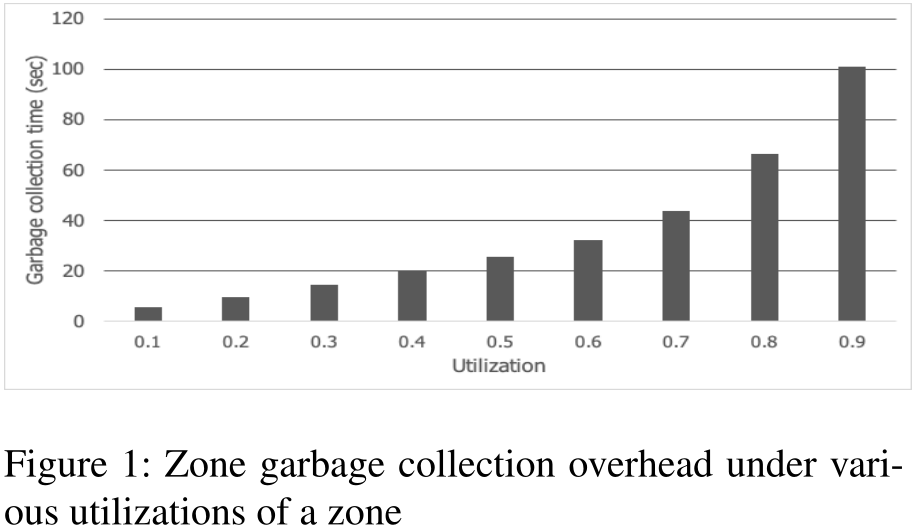
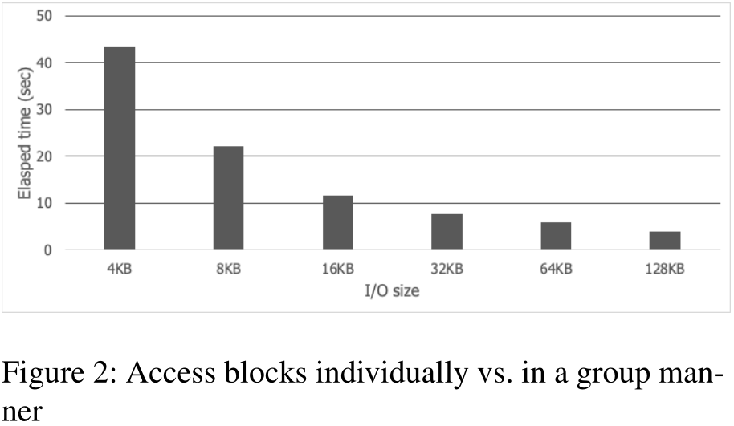
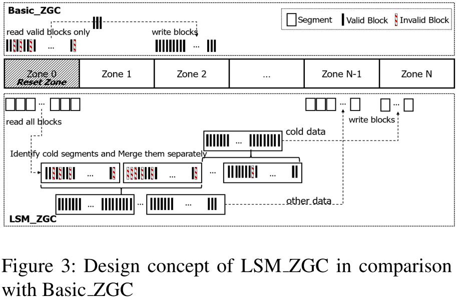
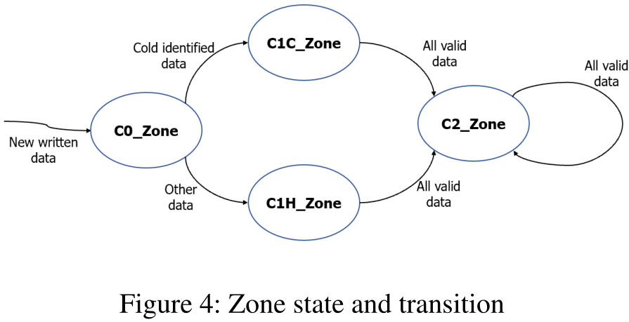
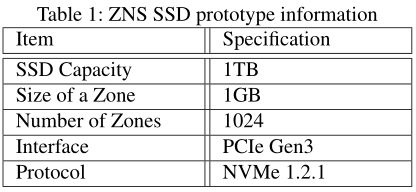
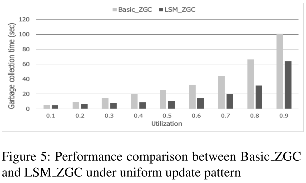
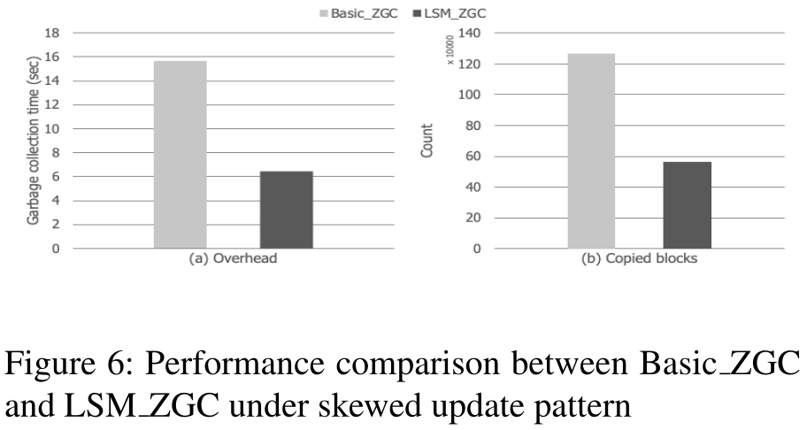
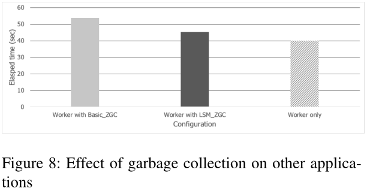
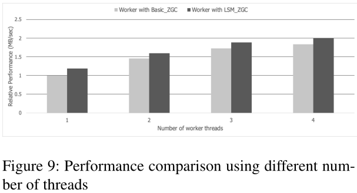

# A New LSM-style Garbage Collection Scheme for ZNS SSDs

## 摘要

本文探讨了如何为ZNS SSDs设计一种垃圾回收方案。我们首先观察到，由于Zone大小过大，基于Zone单元的简单垃圾收集会导致很长的延迟。为了解决这个问题，我们设计一个新的方案，称为LSM_ZGC(Log-Structured Merge style Zone Garbage Collection，日志结构合并式区域垃圾回收)，利用了以下三个特性：基于段的细粒度垃圾回收，以组方式阅读有效和无效数据，将不同的数据合并到单独的区域。我们的方案可以利用Zone的内部并行性，并通过隔离热数据和冷数据来减少候选区域的利用率。基于实际实现的实验结果表明，该方案的性能平均提高1.9倍。

## 1. 引言

ZNS SSD是一把双刃剑。通过将不同的工作负载划分到不同的区域，可以提高性能并降低WAF(写入放大系数)。缺点是主机需要直接管理ZNS SSD，并且有顺序写约束。

本文讨论了为ZNS SSD设计垃圾收集方案时的设计注意事项。一种简单的方法是应用传统的方案，如LFS(日志结构文件系统)使用的段清理或FTL使用的垃圾收集。唯一的区别是，它基于Zone单位而不是Segment单位应用垃圾收集。然而分析显示，这种方法会导致较长的延迟，因为一个Zone的大小(0.5 GB - 1 GB)远远大于一个Segment的大小(2 MB - 4 MB)。

为了克服这个问题，我们提出了一个新的区域垃圾收集方案，称为LSM ZGC。我们发现传统的段概念对于回收ZNS SSD中的一个区域仍然有价值。具体来说，LSM ZGC将一个区域划分为多个区段，并分别管理这些区段的有效位图、利用率等信息。它以LSM方式进行垃圾收集，从候选区域读取所有数据，识别冷数据，将它们合并到一个区域，同时将剩余数据合并到另一个区域。

我们的方案有几个优点。基于段单元而不是区域单元的垃圾收集成为冷热分离的有效基础，并使我们的方案以流水线的方式运行。读取段中的所有数据，包括有效和无效的数据，可以通过利用区域中的内部并行性来减少垃圾收集开销。根据数据的冷热特性将数据合并到单独的区域可以增加找到利用率较低的区域的机会。

我们在一个真正的ZNS SSD原型上评估LSM ZGC。我们实现了一个用户级的基准测试工具，可以直接操作原型并测量各种垃圾收集方案的开销。实验结果表明，该方案最高将垃圾收集性能提高了2.3倍，平均提高了1.9倍。它还减少了与其他应用程序的干扰，并为多线程提供了更好的可伸缩性。

本文的其余部分组织如下。在第2节中，我们将介绍我们的两个观察结果。第3节描述了如何设计我们的方案。评价结果在第4节中讨论。我们将在第5节中解释结论和未来的工作。最后，讨论主题在第6部分给出。

## 2. 动机

在本节中，我们将简要介绍ZNS SSD的特性。然后，我们讨论了在一个真正的ZNS SSD原型上进行的观察。我们的实验原型的细节将在第4节中进一步解释。

### 2.1 ZNS SSDs

ZNS SSD是一种OCSSD(Open-Channel SSD)，它使用zone概念公开SSD内部。具体来说，ZNS SSD设备的地址空间被划分为多个区域，这样做有两个好处。首先，它们通过将具有不同特征的数据分配到不同的区域来提高性能和减少WAF。其次，它们可以减少甚至删除FTL功能，从而减少DRAM的使用和SSD中的过度配置区域。因此，许多供应商最近宣布了他们的ZNS SSD解决方案和计划。

然而，ZNS SSD有两个挑战。第一个是主机软件需要显式地处理每个区域，例如区域重置、打开、读、写和区域垃圾收集。第二个挑战是ZNS SSD有一个惟一的约束，称为顺序写约束。一个区域内的所有数据都需要按顺序写入，就像SMR驱动器。

### 2.2 观察

图1显示了各种分区利用率情况下的定量分区垃圾收集开销。在本实验中，Zone的大小为1GB, segment的大小为2MB, block的大小为4KB。即一个zone由512个segment组成，而一个segment由512个block组成。我们测量区域垃圾收集开销，即将一个有效块从候选区域复制到一个新区域，直到候选区域中没有剩余的有效块为止所花费的总时间。开销还包括重置候选区域的时间。

从这个图中，我们可以观察到垃圾收集开销随着利用率如预期的增长而增加。令人惊讶的是，当利用率大于0.4时，由于复制有效块的开销，开销会超过20秒。这个长复制时间可能会干扰用户请求，导致一个很长的延迟。虽然我们可以通过引入优先权的方法来隐藏开销，但区域的巨大规模使其相当复杂。这一观察结果揭示了降低候选区域的利用率对于ZNS SSD是必不可少的。

图2展示了我们的第二个观察结果，比较了单独读取一个区域内所有块(每个请求的I/O大小为4KB)和分组读取(每个请求的I/O大小为8KB ~ 128KB)所用的总时间。结果表明，分组访问要比单独访问快得多。这是因为它不仅可以减少请求的数量，而且还可以利用ZNS SSD中的内部并行性。通常，ZNS SSD中的一个区域被分散到多个通道中，这样就有机会并行处理带有连续块的请求，比如OCSSD。这一观察促使我们设计LSM风格的垃圾收集方案。

## 3. 设计

在本节中，我们首先描述ZNS SSD的基本垃圾收集方案。然后，我们解释了我们的方案，对比了我们的方案与基本方案的差异。

ZNS SSD中区域垃圾收集的一种简单方法是选择利用率最小的候选区域。然后，它从选定的区域读取有效的块，并将它们写入一个新的区域。最后，它为选定的区域发出reset命令。我们将此方案称为Basic ZGC，如图3所示。

我们的LSM ZGC方案有三个不同之处。一是基于段单元进行垃圾回收。这种方法可以很容易地将热数据和冷数据分隔到不同的区域，图4将进一步讨论这一点。此外，它允许使用细粒度分段单元执行区域垃圾收集，其中段的读取、合并和写入可以以流水线的方式完成。

其次，在垃圾收集期间，它以128KB的I/O粒度，不仅读取有效块，而且还读取无效块，而Basic ZGC只读取有效块。请注意，为硬盘设计的原始LFS读取所有数据，就像我们的方案一样。然而，大多数为SSD设计的文件系统和FTL只读取有效数据，因为在闪存中没有查找开销。我们认为，在ZNS SSD中读取所有块是一个可行的选择，以完全获得图2中所示的内部并行性。实际上，我们在设计LSM ZGC时考虑了候选段的利用。当一个段中有效块的数量小于16时，LSM ZGC只读取有效块。否则，它读取所有的块，因为16个128KB大小的请求可以覆盖整个2MB段数据。

第三个区别是，LSM ZGC试图识别冷数据，并将它们合并到一个单独的区域。为此，我们定义了一个区域的四种状态，即C0区域、C1C区域、C1H区域和C2区域，如图4所示。新到达的数据按顺序写入状态为C0 zone的zone，删除的数据从图中显示的状态退出。

现在假设LSM ZGC选择了一个状态为C0的候选区域。它读取区域中的所有段，并试图识别冷段。我们将利用率高于某个阈值(thresholdcold)的段定义为cold。这一决定是基于我们观察到的具有相似寿命的数据表现出很强的空间局域性。例如，在一个键值存储中，每个级别显示不同的生命周期，同一级别的sstable以批处理的方式写入，这在以前的研究中也得到了观察。将标识为cold的有效块合并写入状态为C1C zone的zone中，其他段的有效块被合并写入到另一个状态为C1H zone的区域。

当一个候选区域是C1C区域或C1H区域时，LSM ZGC读取所有段，并将所有有效块视为冷块。这是因为这些有效的块在两次垃圾收集之后仍然存在。它们被合并并写入一个状态为C2区域的区域。我们可以进一步扩展，比如C3区域等等，但是，在这个研究中，我们在这里停止，并将从C2区域幸存下来的有效块写入另一个C2区域。我们希望这种机制能够将冷数据与其他数据隔离开来，从而增加了在垃圾收集期间找到利用率较低的候选区域的机会。

## 4. 评估

### 4.1 实验设置

通过实际实现的实验对LSM ZGC进行了评价。我们的实验系统由Intel Core i7-6700K处理器(8核)、16GB DRAM和1TB ZNS SSD原型组成。这个原型是我们团队为研究目的开发的，不是商业产品。它的内部类似于已发布的ZNS SSD。原型信息汇总在表1中。

在这个硬件环境中，我们构建了一个垃圾收集基准工具，该工具在用户级别上运行，以评估我们的方案。该工具由三个阶段组成。在第一阶段，通过写入虚拟数据初始化ZNS SSD原型，直到总体利用率成为预定义的目标值。在这个阶段，我们可以配置控制参数，比如用于初始化的区域数量和总体目标利用率值。

在第二个阶段，它在各种模式(如平坦模式、倾斜模式或用户指定模式)下更新初始化的数据。这种更新将一直执行，直到覆盖了所有初始化的区域(有效或无效的块)。例如，当我们设置区域数为512，目标值为0.5时，第一阶段用虚拟数据填充256个区域。然后，在第二阶段，它修改数据(使原始数据失效并写入新的有效数据)，直到512个zone中的所有块要么有效要么无效。注意，利用率仍然是0.5。

在第三个阶段，该工具执行Basic ZGC或LSM ZGC，并测量其运行时间。我们可以配置在垃圾收集和thresholdcold期间想要回收的空闲块的数量。该工具还配备了区域重置、打开、读和写等功能，以便可以在用户级别上直接操作ZNS SSD。此外，它还考虑了多种数据结构，如每个段的位图来区分有效和无效的块，以及每个段和区域的使用信息。我们通过修改NVMe命令行接口来实现该工具。

### 4.2 垃圾回收开销

图5为两种方案的性能对比结果。在本实验中，我们将初始化的区域数量设置为512个，总体目标利用率值如图x轴所示。我们还将更新模式配置为统一的，这意味着所有段的利用率与总体目标利用率相似。回收块个数为512x512，冷阈值为0.4。

从图5中，我们可以看到，我们提出的LSM ZGC比Basic ZGC的性能高出2.3倍，平均是1.9倍。当我们计算在垃圾收集期间复制到新区域的块的数量时，LSM ZGC和Basic ZGC显示相同的数字。这意味着性能的提高来自于请求所有128KB大小的I/O。注意，为了进行公平比较，我们实现了Basic ZGC，它以128KB大小写入所有数据，如果有效块是连续的，则读取尽可能大的数据块。但是，无效块的存在阻止了Basic ZGC生成128KB大小的请求。相反，我们的方案生成所有128KB大小的请求，通过读取有效和无效的块来允许这些请求。

### 4.3 数据分离的影响

为了评估数据分离的效果，我们进行了一个以倾斜模式更新数据的实验。具体来说，在第二阶段，该工具以70%的概率更新30%的数据。然后，一些段的利用率比其他段低，最终合并并写入具有图4中解释的不同状态的区域。在重复执行第二和第三阶段后，我们测量了两种方案下的开销。

图6显示了利用率为0.8时的性能比较结果(由于页面限制，我们只给出这个结果，但其他利用率不同的结果显示了类似的趋势)。结果表明，与Basic ZGC相比，LSM ZGC可以减少垃圾收集的开销。这个增益有两个来源。一个是请求128KB大小的I/O。第二个来源是在垃圾收集期间减少复制的块，如图6 (b)所示。LSM ZGC将冷数据从其他数据中分离出来，这允许选择利用率较低的候选区域。图7显示了Basic ZGC和LSM ZGC的使用分布，这一点更加明显。如您所见，数据分离产生了一个双峰分布，它允许增加找到利用率低的区域的可能性。

我们使用基于段的细粒度垃圾收集来适当地回收一个基本原因。由于区域的巨大规模，一个区域即使在扭曲的模式中也有同时包含热数据和冷数据的倾向，模糊了一个区域是热还是冷。但是，在段级上更明显，因为段比区域小得多。然而，数据分离的有效性取决于各种参数，包括热/冷比、热/冷数据大小、我们的控制参数阈值cold和初始热/冷布局，这些都由分配策略控制。我们把对这些问题的调查留作未来的工作。

### 4.4 对应用的影响

图8展示了LSM ZGC如何影响其他应用程序的延迟。对于这个实验，我们构建了一个工作线程，它将一个新的1GB文件写入ZNS SSD原型并随机读取它。我们测量了三种情况下的执行时间;1)当它单独运行时，2)当它与LSM ZGC同时运行时，3)当它与Basic ZGC同时运行时。

从图8中，我们可以看到，当worker单独运行时，它的执行时间大约是40秒。LSM ZGC的时间是45秒，而Basic ZGC的时间是53秒。这些结果表明了LSM ZGC的成本和效益之间的权衡。LSM ZGC的成本是在垃圾收集期间同时读取有效块和无效块，从而增加了读取量，而好处是它减少了垃圾收集开销。图8表明，这种好处可以补偿成本，极大地减少了干扰。

### 4.5 伸缩性

图9显示了使用多个线程运行worker时的性能。在此图中，y轴是相对于使用Basic ZGC运行单个工作线程的情况的吞吐量(MB/秒)。这些结果表明，多线程可以提高ZNS SSD上的吞吐量。我们还发现LSM ZGC提供了比Basic ZGC更好的可伸缩性。

然而，我们的ZNS SSD原型的可伸缩性不是线性的。当我们设计ZNS SSD时，在两个极端之间有一个频谱。一个极端是为区域分配尽可能多的通道，以改善区域内的并行性。另一个极端是将不同的通道(或多个通道)分配到一个区域以支持隔离。真正的ZNS ssd介于这两个极端之间。在实际应用中，由于信道数量有限，区域间不可避免地存在信道共享，从而导致了信道的非线性可扩展性。但是很明显，我们的方案可以通过减少垃圾收集开销来减少区域之间的干扰。

LSM ZGC的一个有益特性是，它对生成顺序写有积极的影响。将新写入的数据顺序写入状态为“C0 zone”的zone中。此外，LSM ZGC管理的回收数据也会按顺序写入。因此，我们的建议符合ZNS SSD所需的顺序写约束。然而，保证约束是一个复杂的问题，不仅涉及分配策略，还涉及缓存和I/O调度。探索这个问题是将来的工作。

## 5. 总结

本文提出了一种新的区域垃圾回收方案LSM ZGC。我们的贡献包括1)设计一个新的LSM风格的垃圾收集方案，2)提供真正的基于实现的评估结果，3)提出几个问题来解决ZNS SSD特性，如区域大小和顺序写约束。

未来的研究有两个方向。第一个是在真实的文件系统中实现我们的方案。我们目前正在我们的ZNS SSD原型上扩展F2FS，以集成LSM ZGC，并遵守顺序写约束，不仅是数据，而且元数据，如检查点和NAT。第二个方向是LSM ZGC在不同的工作负载下使用不同的热/冷比、数据大小、初始放置和分类策略进行评估。

## 6. 讨论

我们的方案介绍了未来研究的几个有趣的主题。它们可以分为三类。第一个是关于ZNS SSD的文件系统需要哪些特性?如何改变传统的缓存和I/O调度机制来保证顺序写约束?如何识别不同的工作负载并根据其特征分配它们?如何在ZNS SSD中使用匿名写来支持zone append命令?

第二类是关于哪些应用程序可以获得ZNS SSD的好处。例如，具有一次写多次读属性的应用程序是否适合ZNS SSD?键值存储被认为是一个很好的候选，因为它具有顺序写模式。然而，仍然存在一些问题，如新的压缩算法和如何分配level到zone。此外，如何将ZNS SSD集成到分布式存储后端，如Ceph，是一个悬而未决的问题。

最后一类是关于ZNS SSD的内部结构。如何平衡区域内和区域间并行性之间的权衡。它极大地影响了性能和隔离。zone大小和可以同时打开的zone数量也会影响ZNS ssd的系统软件设计。更基本的问题是哪一个更好?管理主机中的SSD或存储中的处理。