## 摘要

在现代服务器cpu中，L3缓存(last-level cache, LLC)是影响工作负载性能的关键硬件资源，如何管理LLC是多租户云中性能隔离和QoS的关键。在本文中，我们认为除了CPU核，高速I/O对LLC管理也很重要。这是因为英特尔的架构创新——Data Direct I/O (DDIO)——直接将入站I/O流量注入LLC(部分)，而不是主存。我们总结了由DDIO引起的两个问题，并表明(1)默认的DDIO配置可能并不总是达到最佳性能，(2)DDIO可以降低与它共享LLC的非I/O工作负载的性能，最高可达32%。

然后我们介绍了IAT，它是第一个将I/O视为一等公民的LLC管理机制。IAT使用CPU的硬件性能计数器监视并分析核心/LLC/DDIO的性能，并为DDIO或需要更多LLC容量的租户自适应地调整LLC方式的数量。此外，IAT动态地选择与DDIO共享LLC资源的租户，以最小化租户和I/O的性能干扰。我们对多个微基准测试和实际应用程序的实验表明，IAT可以以最小开销有效、稳定地降低DDIO造成的性能下降。

## 1. 引言

基础设施即服务(infrastructure-as-a-service, IaaS)在云数据中心的主导地位已经在全世界可见。IaaS向上层租户隐藏底层硬件，并允许多个租户通过虚拟机(VM)和容器(即工作负载并置)等虚拟化技术共享相同的物理平台。这不仅方便了云的操作和管理，而且实现了高效率和硬件利用率。

然而，多租户云中的工作负载并置的好处不是免费的。不同的租户之间可能会争夺共享的硬件资源，这往往会导致严重的性能干扰。因此，我们需要小心地为租户分配和隔离硬件资源。在这些资源中，CPU的最后一级缓存(LLC)具有比基于RAM的内存更高的访问速度和有限的容量(例如，几十MB)，是一个关键的资源。

关于如何通过硬件或软件方法为不同的CPU核(即租户)划分LLC的建议有很多。最近，Intel Resource Director Technology(RDT)在普通硬件上以缓存粒度的方式支持LLC分区和监控。这刺激了现实世界中LLC管理机制的创新，以实现多租户和工作量的搭配。然而，Intel的DDIO (Data Direct I/O)技术对高速I/O的作用和影响却没有得到很好的考虑。

传统上，来自(基于pcie的)I/O设备的入站数据被发送到主存，CPU内核稍后将获取并处理它。然而，这种方案效率低下，数据访问延迟和内存带宽消耗。特别是随着具有极高带宽的I/O设备(例如100Gb网络设备和基于nvme的存储设备)到内存的出现，CPU无法及时处理所有的入站流量。导致Rx/Tx缓冲区溢出，出现丢包。相反，DDIO直接将入站数据引导到LLC(部分)，从而显著减轻了内存的负担(见第II-B节)，这导致了低处理延迟和来自核心的高吞吐量。换句话说，DDIO让I/O与核心共享LLC的所有权(即，I/O也可以读/写cacheline)，这对于I/O密集型平台尤其有意义。

通常，DDIO对操作系统和应用程序是完全透明的。但是，这可能导致性能不佳，因为(1)网络流量随着时间的变化而变化，每个租户的工作负载也会变化，并且(2)I/O设备可以与核心竞争LLC资源。此前，研究人员已经发现了“Leaky DMA”问题，即设备Rx环缓冲区大小可能超过LLC用于DDIO的容量，使数据在LLC和主存之间来回移动。虽然ResQ提出了一个简单的解决方案，即适当调整Rx缓冲区的大小，但我们的实验表明，这往往会影响性能(见第III-A节)。另一方面，我们还确定了另一个与DDIO相关的低效率，“Latent Contender”问题(见第III-B节)。也就是说，在没有DDIO感知的情况下，CPU核心被分配了与DDIO使用相同的LLC方式，这导致了LLC的低效利用。我们的实验表明，即使是非I/O工作负载，这个问题也会导致32%的性能下降。这两个问题说明了纯粹面向核心的LLC管理机制的不足，需要DDIO的可配置性和可感知性来实现极致的I/O性能。

为此，我们提出IAT，据我们所知，这是第一个I/O感知LLC管理机制。IAT使用CPU的硬件性能计数器定期收集核心、LLC和I/O活动的统计数据。根据统计数据，IAT用有限状态机(FSM)确定当前系统状态，确定争用是来自核心还是来自I/O，然后自适应地为核心或DDIO分配LLC方式。这有助于减轻Leaky DMA问题的影响。此外，IAT通过打乱LLC方式的分配，排序并选择内存密集型最少的租户与DDIO共享LLC方式，从而减少了核心和I/O之间的性能干扰(即Latent Contender问题)。

我们将IAT开发为Linux中的用户空间守护进程，并在具有高带宽网卡的商用服务器上对其进行评估。我们的结果与微基准测试和实际应用表明,相比运行一个工作负载,应用IAT在多租户的场景中可以限制网络和nonnetworking应用程序的性能下降不到10%,而没有IAT,这种退化可高达∼30%。

## 2. 背景

### 2.A 现代服务器CPU中管理LLC

如既往研究所述，共享LLC会导致并置的VM/container之间存在性能干扰。这推动了在现代服务器CPU上进行LLC监控和分区的实践。从Xeon®E5 v3一代开始，Intel开始提供RDT用于内存层次结构中的资源管理。在RDT中，缓存监控技术(CMT)提供了通过不同内核监视LLC利用率的能力;缓存分配技术(CA T)可以将LLC的方式分配给不同的核(从而提供给不同的租户)。程序员可以通过访问相应的特定于模型的寄存器(MSR)或使用高级库来利用这些技术。此外，动态模型可以建立在RDT之上。

### 2.B DDIO技术

通常，来自PCIe设备的直接内存访问(DMA)操作使用内存作为目的地。也就是说，当数据从设备传输到主机时，数据将被写入设备驱动程序指定的地址的内存中，如图1所示。之后，当CPU核心被告知传输完成后，它会将数据从内存中提取到缓存层进行后续处理。然而，由于过去几十年来I/O设备的带宽急剧增加，这种DMA方案的两个缺点变得突出:(1)访问内存相对耗时，这可能限制数据处理的性能。假设我们有100Gb的入站网络流量。对于一个64B包和20B以太网开销，包到达率是148.8 Mpps。这意味着I/O路径上的任何组件，如I/O控制器或核心，必须在每个包上花费不超过6.7ns，否则将发生丢包。(2)占用大量内存带宽。同样是100Gb的入站流量，对于每个包，它将至少写入内存一次，并从内存读取一次，这很容易导致100Gb/s×2=25GB/s内存带宽消耗。

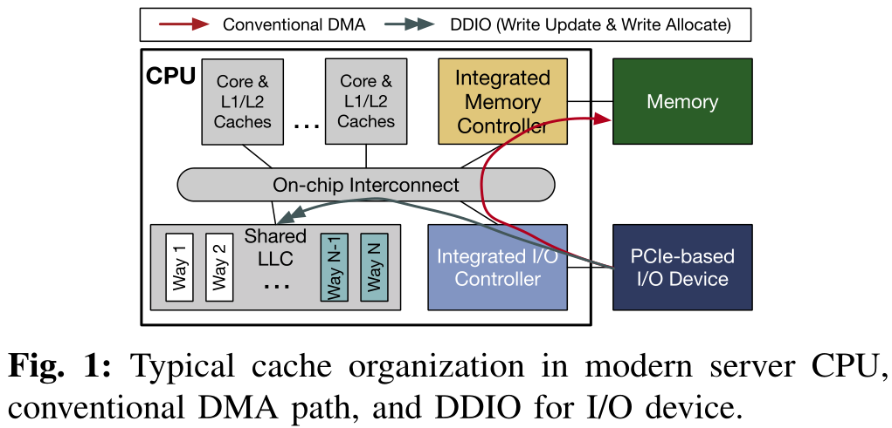

为了减轻内存负担，Intel提出了直接缓存访问(DCA)技术，允许设备直接将数据写入CPU的LLC。在现代Intel Xeon CPU中，这已经实现为数据直接I/O技术(DDIO)，这对软件是透明的。具体来说，如图1所示，当CPU从设备接收到数据时，会进行LLC查找，检查对应地址的cacheline是否以有效状态存在。如果是，这个cacheline将使用入站数据进行更新(即write update)。如果不是，入站数据将被分配给LLC(即write allocate)，脏cacheline可能被逐出内存。默认情况下，DDIO只能对LLC的两个way(图1中的Way N−1和Way N)进行write allocate。同样，DDIO也可以直接从LLC读取数据;如果数据不存在，设备将从内存中读取数据，但不将其分配到LLC。之前的全面研究表明，在大多数情况下(除了那些具有持久性内存)，与禁用DDIO的系统相比，在同一个系统上启用DDIO可以通过减少内存访问延迟和减少内存带宽消耗来提高应用程序性能。注意，即使禁用了DDIO，入站数据一开始仍然在缓存中(并立即被逐出到内存中)。这是一个性能方面的考虑，因为在进入相干域(即缓存)之后，没有依赖关系的读/写操作可以无序执行。

虽然DDIO是特定于intel的，但其他cpu可能也有类似的概念(例如，ARM的Cache Stashing)。本文的大部分讨论也适用于此。

### 2.C 虚拟化服务器中的租户-设备交互

现代数据中心采用两种流行的模型来组织多租户虚拟化服务器中的I/O设备，并进行不同的权衡。如图2所示，关键的区别在于它们与物理设备的交互方式。

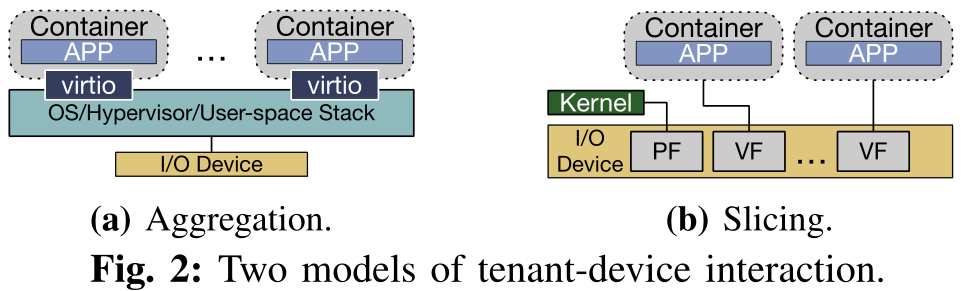

在第一个模型中，逻辑上集中的软件堆栈被部署用于I/O设备交互。它可以在操作系统、管理程序甚至用户空间中运行。例如，针对网卡开发了兼容SDN的虚拟交换机如Open vSwitch(OVS)、VFP等。对于SSD, SPDK是一种高性能、可扩展的用户空间堆栈。如图2a所示，软件栈控制物理设备，向物理设备发送/接收数据包。租户通过诸如virtio这样的接口连接到设备。由于此模型中的所有流量都需要通过软件堆栈，所以我们称此模型为“Aggregation”。

在第二个模型(图2b)中，利用了基于硬件的单根输入/输出虚拟化(SR-IOV)技术。通过SR-IOV，一个物理设备可以被虚拟成多个虚拟功能(VFs)。当物理功能(PF)仍然连接到主机操作系统/管理程序时，我们可以将vf直接绑定到租户(即主机旁路)。换句话说，基本的交换功能被卸载到硬件上，每个租户直接与物理设备进行数据接收和传输。由于该模型将硬件资源分散并将其分配给不同的租户，因此也称为“Slicing”。请注意，许多用于多租户的硬件卸载解决方案可以本质上视为切片模型。

## 3. 动机：I/O对LLC的影响

### 3.A Leaky DMA问题

“Leaky DMA”问题已经被多篇论文观察到。在默认情况下,只有两个LLC的way提供给DDIO的write allocate,当入站数据率(例如,NIC Rx率)高于CPU核可以处理的速度,LLC中等待处理的数据很可能会(1)被驱逐到内存作为新传入的数据,(2)当一个核心需要它时，它又被带回LLC。这对于大数据包尤其显著，因为在传输中的数据包数量相同的情况下，大数据包比小数据包消耗更多的缓存空间。因此，这会导致额外的内存读写带宽消耗，并增加每个包的处理延迟，最终导致性能下降。

在ResQ中，作者提出通过减小Rx/Tx缓冲区的大小来解决这个问题。然而，这种解决方案也有缺点。在云环境中，数十甚至数百个虚拟机/容器可以通过虚拟化堆栈共享两个物理端口。如果所有缓冲区中的条目总数保持在DDIO的LLC默认容量以下，每个VM/容器只能得到一个很浅的缓冲区。例如，在SR-IOV设置中，我们有20个容器，每个容器分配一个虚拟函数来接收流量。为了保证所有缓冲区都能容纳在默认的DDIO缓存容量(几个MB)中，每个缓冲区只能有少量的条目。一个浅的Rx/Tx缓冲区可能会导致严重的包丢失问题，特别是当我们有突发流量时，这在现代云服务中是普遍存在的。因此，虽然此设置可以用于静态平衡的流量，但对于某些“heavy hitter”容器，动态不平衡的流量将导致性能下降。

这里我们运行了一个简单的实验来证明这种低效率(参见第VI-A节来了解我们设置的细节)。我们在单核流量路由测试平台上建立了DPDK l3fwd应用程序。它针对1M流的流表查看每个网络包的头(以模拟真实的流量)。如果匹配，则转发报文。我们从带有小(64B)或大(1.5KB)包的流量生成器机器上运行RFC2544测试(即，测量零包丢失时的最大吞吐量)。从图3的结果中，我们观察到对于大数据包的情况(图3b)，收缩Rx缓冲区大小可能不是问题——直到大小为典型值的1/8时，吞吐量才会下降。然而，小数据包的情况是完全不同的情况(图3a) -通过减少一半的缓冲区大小(从1024到512)，最大吞吐量可以减少13%。如果我们使用64个条目的小缓冲区，吞吐量小于原始吞吐量的10%。在这两种情况中，关键因素是数据包处理速率。在较高的速率下，小包流量倾向于更密集地压迫CPU核心(即较少空闲和繁忙的轮询时间)。因此，任何倾斜都会导致Rx缓冲区中的生产者-消费者不平衡，而浅缓冲区更容易溢出(即数据包丢失)。因此，调整缓冲区大小并不是解决现实世界中复合和动态改变流量的万能药。这促使我们不仅调整缓冲区的大小，而且调整DDIO的LLC容量。

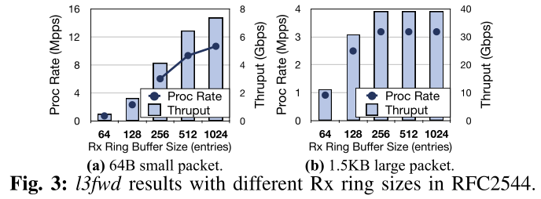

### 3.B Latent Contender问题

我们确定了由DDIO引起的第二个问题——“潜在竞争者”问题。也就是说，由于目前大多数LLC管理机制都不知道I/O，当使用CAT为不同的核分配LLC way时，它们可能会不自觉地将DDIO的LLC way分配给某些运行LLC敏感工作负载的核。这意味着，即使这些LLC方式从核心的角度完全隔离，DDIO实际上仍然在与核心争夺容量。

我们又做了一个实验来进一步证明这个问题。在这个实验中，我们首先设置一个绑定到一个CPU核、两个LLC way(即Way 0−1)和一个NIC VF的容器。该容器运行DPDK 13fwd，流量为40Gb。然后我们设置另一个容器，它运行在另一个核心上。我们运行X-Mem，这是一个用于云应用程序内存行为特征的微基准测试。我们将X-Mem的工作集从4MB增加到16MB，并应用随机读内存访问模式来模拟真实应用程序的行为。我们在两种情况下测量X-Mem的平均延迟和吞吐量:(1)容器绑定到两个专用LLC方式(即，没有重叠)，(2)容器绑定到两个DDIO的LLC方式(即，DDIO重叠)。如图4所示，即使X-Mem和l3fwd从核心角度没有明确地共享任何LLC方式，DDIO仍然可能使X-Mem的吞吐量恶化高达26.0%，平均延迟恶化高达32.0%。这让我们可以考虑如何选择与DDIO共享LLC方式的租户。

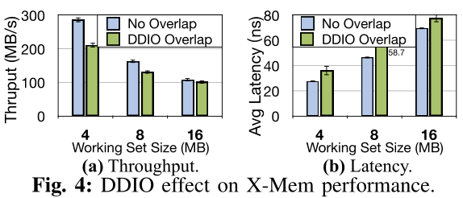

一些之前的工作建议在核心LLC分配中根本不使用DDIO的LLC way。我们认为它们不是最优的，有两个基本原因。(1)我们的动机是，我们应该动态地为DDIO分配更多/更少的LLC方式(第三-a节)。在某些情况下，如果DDIO占据了LLC的很大一部分，那么核心的LLC分配空间就很小。(2)当I/O流量不对LLC产生压力时，隔离DDIO的LLC way是浪费的。最好是更有效地利用LLC的这部分。

## 4. IAT设计

IAT是一种I/O感知的LLC管理机制，它可以更好地在多租户服务器的各种情况下使用DDIO技术。当IAT从DDIO流量中检测到LLC miss的数量增加时，它首先确定miss是由I/O流量还是运行在核心中的应用程序引起的。在此基础上，IAT为核心或DDIO分配更多或更少的LLC方式，以减轻核心到I/O或I/O到I/O的干扰。IAT还可以调整租户的LLC分配，以进一步减少core-I/O争用。具体来说，IAT执行了6个步骤来实现其目标，如图5所示。

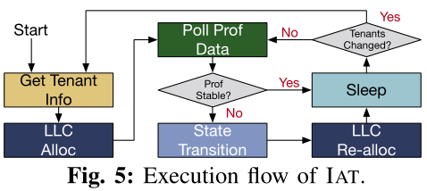

### 4.A 获取租户信息和LLC分配

初始化(或租户变更)时，IAT通过“Get Tenant Info”步骤获取租户信息和可用的硬件资源。在硬件资源方面，需要了解并记住每个租户所分配的内核和LLC way;对于软件，它需要知道两件事:(1)租户的工作负载是否为“I/O”(如本文中的“networking”)。这可以帮助IAT确定性能波动是否由I/O引起，因为非I/O应用程序也有具有不同行为的执行阶段。请注意，非I/O租户可能维护到I/O设备的连接(对于ssh等，但不是密集的I/O流量)。(2)每个租户的优先级。为了提高资源利用率，现代数据中心倾向于在同一物理平台上分配具有不同优先级的工作负载[20,49]。由于集群管理软件通常提供这些优先级的提示[68]，IAT可以直接获得这些信息。在IAT中，我们假设每个工作负载有两个可能的优先级(在实际部署中可能有更多)——“性能关键型(PC)”和“最佳努力型(be)”。尽管聚合模型中的软件堆栈(例如虚拟交换机)不是一个租户，但我们仍然为它保留记录，并为它分配一个特殊的优先级。

在获得租户信息之后，IAT相应地为每个租户分配LLC方式(即LLC Alloc)。

### 4.B 轮询Prof数据

在这一步中，IAT会对每个租户的性能状态进行轮询，以决定LLC的最优分配。使用应用程序级指标(每秒操作数、尾部延迟等)并不是一个好的策略，因为它们因租户而异。相反，我们直接从硬件计数器中获得以下硬件事件的概要统计信息。

**指令周期(IPC)**

IPC是衡量CPU核心上程序执行性能的常用指标。尽管它对一些微架构因素很敏感，比如分支错误预测和序列化指令，但它在我们的时间尺度上是稳定的(即数百ms到s)。我们使用它来检测租户的性能下降和改进。

**LLC reference和miss**

反映了工作负载的内存访问特征。我们还可以从这些值中得出LLC失误率，这是工作负载性能的另一个关键指标。

**DDIO hit和miss**

DDIO hit是应用write update的DDIO事务的数量，意味着目标cacheline已经在LLC中;DDIO miss反映了应用write allocate的DDIO事务的数量，这表明必须将victim cacheline逐出LLC以进行分配。这两个指标反映了I/O流量的强度及其给LLC带来的压力。

IPC和LLC ref/miss是每核心指标。如果一个租户占用多个核心，我们将聚合这些值作为租户的结果。DDIO命中/未命中是全芯片的指标，这意味着我们只需要对每个CPU收集一次，而不能区分由不同的设备或应用程序引起的这些指标。

收集完这些事件的数据后，IAT将把它们与前一次迭代中收集的数据进行比较。如果其中一个事件的增量大于阈值THRESHOLD_STABLE, IAT将跳转到状态转换步骤，以确定如何(潜在地)调整LLC分配。否则，它将认为系统的状态没有改变，并跳转到Sleep步骤，等待下一次迭代。另外，还有三种情况我们没有跳转到状态转换步骤：(1)如果我们只看到IPC变化，但LLC ref/miss和DDIO hit/miss计数没有显著变化，我们认为这一变化既不是归因于缓存/内存，也不是I/O。(2)如果我们观察到一个非I/O租户(没有DDIO重叠)的IPC变化，LLC reference/miss变化，而DDIO hit/miss count在系统上没有明显的变化，我们知道这主要是由CPU内核对LLC空间的需求引起的。在这种情况下，可以调用其他现有机制来为租户分配LLC way。(3)如果观察一个非I/O租户(DDIO重叠)的IPC变化，LLC reference/miss变化，DDIO hit/miss变化，我们首先尝试shuffle LLC way分配(见第IV-D节)。

### 4.C 状态转换

IAT设计的核心是一个全系统的Mealy FSM，它基于Poll Prof data的数据来决定当前系统的状态。对于每个迭代，如果在Poll Prof Data中发生变化，状态转换(包括自转换)被触发；否则，IAT将保持之前的状态。图6显示了这五种状态。

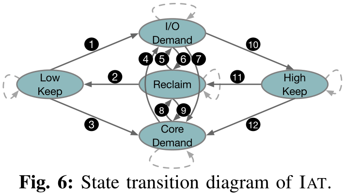

**Low Keep**

在这种状态下，I/O流量不密集，不对LLC产生压力(即不与核竞争LLC资源)。如果DDIO miss计数很小，则IAT处于这种状态。这里的DDIO hit计数并不一定小，因为如果大多数DDIO事务可以以write update结束，LLC抖动将不会发生。因为I/O流量不会触发广泛的缓存失败，我们将DDIO的LLC way的数量保持在最小值(DDIO_WAYS_MIN)。

**High Keep**

在这种状态下，我们已经为DDIO分配了最大数量(DDIO_WAYS_MAX)的LLC way，而不管DDIO未命中和命中的数量。我们设置这样的上限是因为我们不希望DDIO在整个LLC中不受任何约束的情况下与核心竞争，特别是在系统中运行具有高优先级的PC租户时。

**I/O Demand**

这是一种I/O与核争用LLC资源的状态。在这种状态下，I/O流量变得非常密集，用于write update的LLC空间无法满足DDIO事务的需求。因此，系统中更频繁地发生write allocate(DDIO miss)，这将导致大量cacheline逐出。

**Core Demand**

在这种状态下，I/O也会与内核争夺LLC资源，但原因不同。具体来说，现在的核心需要更多的LLC空间。换句话说，一个内存密集型I/O应用程序正在核心上运行。因此，Rx缓冲区经常从分配给核心的LLC way中被排除，导致DDIO命中减少，DDIO未命中增加。

**Reclaim**

与Low Keep类似，在这种状态下，I/O流量不是密集的。不同之处在于，用于DDIO的LLC way的数量处于中等水平，可能存在浪费。在这种情况下，我们应该考虑从DDIO回收一些LLC way。此外，LLC way为一个特定的租户可以多多益善，激励我们从核心回收LLC way。

IAT从Low Keep状态初始化。当DDIO miss数大于阈值THRESHOLD_MISS_LOW时，表示当前DDIO LLC way不足。IAT通过进一步检查DDIO hit值和LLC ref来确定下一个状态。随着LLC ref的增多，DDIO hit计数的减少意味着核心越来越多地与DDIO争夺LLC，并且Rx缓冲区中的条目经常从LLC中逐出。在这种情况下，我们移动到核心需求状态③。否则(即DDIO hit计数的增加)，我们将移动到I/O需求状态①，因为DDIO miss归因于更密集的I/O流量。

在Core Demand状态下，如果我们观察到DDIO miss计数的减少，我们将其视为系统平衡的信号，并将返回到Reclaim状态⑧。如果我们观察到DDIO miss数的增加和DDIO hit数的不减少，我们将进入I/O Demand状态④，因为现在，核心不再是主要的竞争对手。如果我们没有观察到这两个事件，IAT将停留在Core Demand状态。

在I/O Demand状态下，如果我们仍然观察到大量的DDIO miss，我们将保持这种状态，直到我们为DDIO分配了DDIO_WAYS_MAX数量的LLC way，然后转移到High Keep状态⑩。如果出现DDIO miss的严重减少，我们假设DDIO的LLC容量过度供应，并将进入Reclaim状态⑥。同时，更少的DDIO hit和稳定甚至更多的DDIO miss表明核心在竞争LLC，所以我们进入Core Demand状态⑦。High Keep状态也遵循同样的规则——⑪和⑫。

如果在DDIO的LLC way达到DDIO_WAYS_MIN数量之前，我们没有观察到DDIO miss计数有意义的增加，那么我们将保持Reclaim状态②，然后转移到Low Keep状态。否则，我们将转向I/O Demand状态，为DDIO分配更多的LLC way，以摊销来自密集I/O流量的压力⑤。同时，如果我们也观察到DDIO hit数的减少，我们将进入Core Demand状态⑨。

### 4.D LLC重分配

状态转换后，IAT会采取相应的行动，即为DDIO或核心重新分配LLC way。

首先，IAT更改分配给DDIO或租户的LLC way的数量。具体来说，在I/O Demand状态下，IAT每次迭代都会增加DDIO的LLC way的数量(也可以探索类似UCP的基于漏曲线的增量，下同)。在Core Demand状态下，IAT每次迭代都会为所选租户增加LLC way。在Low Keep和High Keep状态下，IAT不改变LLC的分配。在Reclaim状态下，IAT每次迭代从DDIO或核心中回收LLC way，这取决于它观察到的值(例如，系统中更小的LLC miss计数或租户中更小的LLC ref计数)。所有空闲way都在一个池中，以供选择分配。由于当前CAT只允许一个核心具有连续的LLC way，空闲way的选择应尽量与现有分配保持连续。否则，可能会发生洗牌。

IAT应该识别在Core Demand和Reclaim状态下需要更多或更少LLC way的工作负载。该机制依赖于我们正在应用的租户-设备模型的模型。在聚合模型中，所有的Rx/Tx缓冲区都由集中式软件栈分配和管理。这意味着软件堆栈的性能下降会使运行在附加租户中的I/O应用程序的性能受到瓶颈。因此，在这种情况下，IAT首先增加/减少了软件栈核心的LLC way的数量。然而，在切片模型中，每个VF的Rx/Tx缓冲区由租户本身管理。IAT从所有I/O相关租户中选择需要更多LLC way的租户，方法是对其当前迭代和最后一次迭代之间的LLC miss增量(百分比)进行排序，并选择LLC miss率增加最多的租户。这样我们就可以满足相应的core的LLC需求，从而减少DDIO miss。

其次，IAT将洗刷分配给租户的LLC way，即适当选择LLC压力最小的租户，并将其分配的way转移到DDIO的way。正如我们在第III-B节中讨论的，与DDIO共享LLC way可能会导致核心的性能下降，即使核心正在运行非I/O工作负载。因此，有必要减少这种干扰。首先，如果LLC way没有被充分分配，我们应该避免LLC way的core-I/O共享。如果共享是必要的，直观地说，运行PC工作负载(高优先级)的租户应该尽可能地与DDIO的LLC way隔离。IAT尽力只让BE租户与DDIO共享way。同时，我们不希望BE租户过多地与DDIO竞争LLC，因为PC租户的性能与DDIO相关。因此在shuffle之前，IAT根据当前迭代中的LLC ref计数对所有BE租户进行排序，并选择值最小的一个或多个与DDIO共享LLC way。请注意，根据脚注1，经过改组后，租户仍然可以以先前分配的LLC way访问其数据，直到被其他租户驱逐。因此，shuffle不会导致突然的缓存利用率不足和性能下降。

### 4.E 睡眠

在LLC Re-alloc步骤之后，应用程序性能可能需要一段时间才能稳定。此外，轮询性能计数器并不是免费的(参见第VI-D节)。因此，有必要为IAT选择一个合适的轮询间隔(例如，在我们的实验中为1秒)。在这段时间内，IAT将只是休眠，让OS在核心上调度其他任务。在每次Sleep之后，如果IAT被告知租户的变化(例如，租户的增加/移除，应用程序的阶段变化)，它将经历获取租户信息和LLC分配步骤。否则，将进行Poll Prof Data的下一次迭代。

### 4.F 整合

我们使用两个以NIC作为I/O设备的实例来说明IAT的工作原理(如图7所示)。在采用聚合模型的第一个例子(图7a)中，网络流量的吞吐量是固定的。我们有三个租户，一个PC和两个BE，每个分配了不同的LLC way。一开始，网络流量的流量计数很小，BE租户2与DDIO共享LLC way。在t1时，出现了大量的数据流。因此，虚拟交换机中的流表变得更大，需要比已经分配的两种LLC way更多的空间。因此，IAT检测到更多的DDIO miss，更少的DDIO hit，并进入Core Demand状态。然后将另外两个LLC way分配给虚拟交换机(每次迭代一个)，从而使系统达到新的平衡。为了给虚拟交换机腾出空间，我们改变了其他租户的LLC way，让BE租户2与DDIO共享LLC way。在t2，许多流已经结束，虚拟交换机不需要在LLC中维护一个大的流表。IAT进入Reclaim状态，并从虚拟交换机中回收两个LLC way。此外，由于现在我们有空闲的LLC way，我们删除了LLC way的核心-I/O共享。

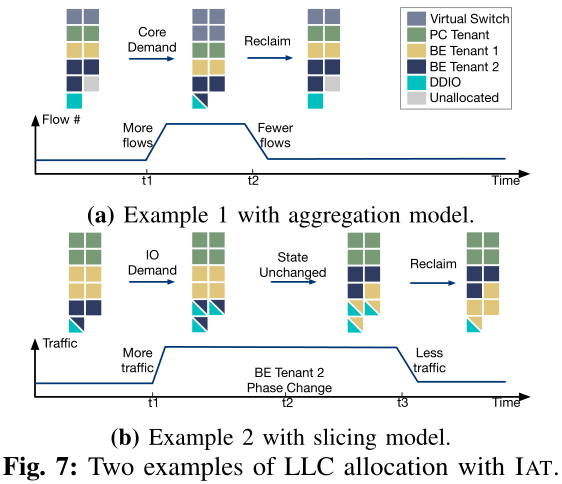

在第二个示例(图7b)中，使用相同的租户设置，但采用切片模型，网络流量的吞吐量从较低的水平开始。在t1时，更多的流量进入PC租户, DDIO的LLC way数量不足，导致更多的DDIO miss。IAT检测到这种情况并转换到I/O Demand状态，为DDIO分配更多的LLC way。在t2, BE租户2中的工作负载进入一个新的阶段，该阶段消耗LLC。IAT通过LLC ref计数的增量注意到这一点，并让消耗较少LLC的BE租户1与DDIO共享LLC way，以减少性能干扰。在t3，传入的网络流量在减少，LLC为DDIO提供的容量已经足够了。因此，IAT可以从DDIO中回收一些LLC way。

## 5. 实现

我们将IAT实现为一个Linux用户空间守护进程，它对应用程序和操作系统是透明的。目前，我们选择用户空间实现，因为它更具可移植性和灵活性。但是，IAT也可以在内核空间中实现。由于用于MSR操作的x86指令(rdmsr和wrmsr)是ring-0，因此内核空间实现可能具有更低的监视和控制开销。另一种可能性是在CPU电源控制器中实现IAT。注意，IAT也可以集成到其他CPU资源管理系统中。

**LLC分配**

对于标准CAT功能(即为核心分配LLC way)，我们利用了来自Intel pqos库的api。为了更好地隔离不同的应用程序并演示DDIO的影响，我们不允许LLC way在不同的租户之间进行共享(但在实际部署中，应该探索共享)。为了更改和查询DDIO的LLC way，我们通过msr内核模块读写与DDIO相关的msr。

**分析和监控**

类似地，我们使用pqos的api进行常规分析和监控(LLC miss, IPC等)。为了监视DDIO的hit和miss，我们使用非核心性能计数器。现代Intel cpu采用了非统一缓存访问(non-uniform cache access, NUCA)架构，将LLC物理拆分为多个切片。为了减少监视开销，对于每个DDIO事件，我们只使用一个LLC片的缓存和主代理(CHA, Intel cpu中每个LLC片的控制器)中的性能计数器。由于现代Intel cpu为LLC寻址应用了一种散列机制，数据(来自核心和DDIO)被均匀地分配到所有LLC片。因此，通过只访问一个LLC片的性能计数器，我们可以通过将其乘以片的数量来推断DDIO流量的全貌。

**租户感知**

由于CAT将LLC way分配给了核心，所以我们需要知道每个租户的核心隶属关系。为简单起见，我们将这种从属记录保存在一个文本文件中。当守护进程启动或收到更改通知时，它将解析此文件中的记录。在真实的云环境中，IAT可以拥有一个到编排器或调度器的接口，以动态查询从属关系信息。

## 6. 评估

### 6.A 实验设置

**硬件**

我们在使用Xeon®Scalable Gold 6140 CPUs@2.3GHz(禁用超线程和Turbo Boost)的四插槽Intel服务器上做实验。可见表I的CPU配置。它有512GB DDR4内存和两个Intel®XL710 40GbE网卡(都连接到socket-0)。我们将每个NIC直接连接到另一个服务器作为流量生成器。使用更高带宽的NIC将使差异更显著，但不会改变观察和结论。

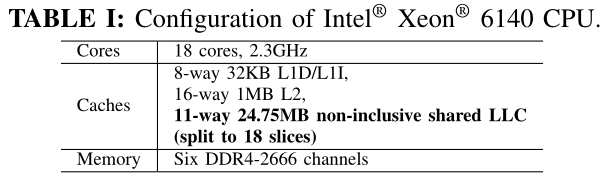

**系统软件**

由于当前DDIO不支持远程socket，我们在socket-0上运行所有实验。为了反映多租户云环境，我们在docker容器中运行应用程序。对于网络连接，我们有两个模型。(1)聚合:通过OVS(基于DPDK)连接物理网卡和容器。(2)切片:我们将物理网卡的一个VF绑定到每个SR-IOV容器。默认情况下，我们使用1024个条目作为Rx/Tx缓冲区大小。对于需要TCP/IP堆栈的容器，我们使用DPDKANS来实现高性能。主机和容器都运行Ubuntu 18.04。为了测量IAT的绝对开销并且不影响租户，我们在一个专用的核心2上运行IAT守护进程。

IAT参数。我们使用经验参数(见表II)保持稳定性和灵活性的平衡。它们可以针对各种QoS需求和硬件进行调优。参数灵敏度类似于dCAT。

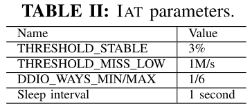

### 6.B 微基准测试结果

我们首先分离第三节中的两个问题，并分别验证IAT能否在微基准测试中缓解它们。

**解决泄漏的DMA问题**

应用聚合模型，我们设置了两个运行DPDK test-pmd(一个返回Rx流量的简单程序)的容器，每个容器都有两个专用核和一个专用LLC way，它们都连接到OVS, OVS运行在两个专用核和两个专用LLC way上。另外，这两个网卡连接到OVS。我们为OVS插入4条规则:"NIC0->Container0"，"NIC1->Container1"，"Container0->NIC0"，"Container1>NIC1"。两个网卡都以线路速率发送单流流量。这样，OVS本身的LLC miss可以忽略不计，不会影响性能。我们从64B包大小开始实验，随着时间的推移，当OVS的性能变得稳定时，我们将包大小增加一倍，直到MTU大小(1.5KB)。

我们收集了基准(即没有IAT的默认DDIO配置，但为核心使用基本静态CAT)和IAT案例的性能数字，并将它们显示在图8中。最基本的结果是DDIO hit数(图8a)和miss数(图8b)。当数据包大小较小时，DDIO的默认两种LLC way足以包含动态入站数据包;然而，随着时间的推移，包的大小增加，动态包给LLC施加了更大的压力，因此LLC的默认两个way变得不足，这反映在DDIO miss率的增加。此时，IAT检测不稳定状态，并将其状态转移到I/O Demand，为DDIO分配更多的LLC way(每次一个)。因此，使用IAT的DDIO hit计数高于基准，而DDIO miss数较低。这导致了图8c中更好的内存吞吐量性能——使用IAT，内存带宽消耗最多可减少15.6%。需要注意的是，由于LLC的容量有限，IAT无法消除内存流量。我们希望结合IAT和一个稍小的Rx缓冲区(如图3中的512)，以实现更好的内存流量减少和适度的吞吐量损失。我们还在图8d中绘制了OVS性能。同样，对于较大的包大小，IAT能够将OVS的IPC提高约5%，并减少每个包的循环(CPP)。

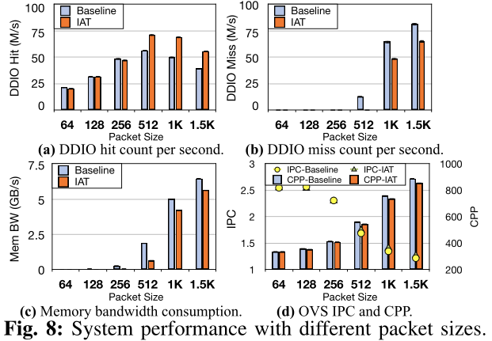

同时，在网络应用中，IAT仍然可以识别核心对LLC容量的需求。我们用类似设置的第二个实验来演示这一点。不同的是，我们将流量固定在64B行速率(这样核心将是LLC miss的主要来源)。我们从单流量开始线速流量，逐渐增加流量中的流量数量，并在图9中报告性能。为了维护流表中不断增长的流数量，OVS需要更多的内存空间。因此，如果我们为OVS保持静态的初始LLC分配，在超过1k流之后，它将遭受更高的LLC miss计数(从而降低IPC)。另一方面，IAT通过检测IPC的下降和LLC miss率的增加，能够识别出OVS的内核对LLC的需求，并为其分配更多的LLC way。因此，OVS保持了较低的LLC miss计数，IPC最多比基准高11.4%。请注意，随着流的增加，IPC和CPP不可避免地会恶化，因为OVS的设计导致更多(更慢的)通配符查找，而不是纯粹的(更快的)精确匹配查找。我们还用3个、4个和5个容器重复实验，观察性能的改进情况。

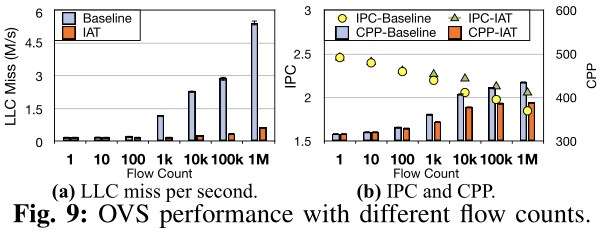

**解决潜在竞争者问题**

利用切片模型，我们证明了IAT可以有效地选择核与I/O之间的LLC共享策略。每个NIC都有一个VF，并将它们绑定到两个运行DPDK test-pmd的容器(0和1，标记为PC)。每个容器运行在一个专用核心上，它们共享三个专用LLC way(没有DDIO重叠)。在每个NIC上，我们生成具有不同包大小的单流线速率流量。此外，我们有三个相同的容器(2和3作为BE, 4作为PC)，每个都有一个专用核心和两个专用LLC way(没有DDIO重叠)运行X-Mem(随机读取模式)。一开始，所有X-Mem容器都有一个2MB的工作集。在时间5s，我们将容器4的工作集大小增加到10MB (L2缓存大小+ 4 LLC ways大小)。此外，在15s时，当系统已经稳定时，我们手动将DDIO的LLC way计数从2个增加到4个，以观察IAT是否能够动态缓解DDIO重叠干扰。除了基线和IAT，我们还测试了两种情况:(1)Core-only，这意味着我们只调整LLC分配而不考虑I/O的感知;(2)I/O-iso以core-only为基础，进一步将DDIO的方式排除在core的LLC分配之外。这些是为了模仿其他最先进的LLC管理机制的行为进行比较。我们在图10中报告了X-Mem在容器4(PC)中的(稳定)性能。5秒之后，当容器4的工作集大小急剧增加时，IAT开始为容器4分配更多的LLC way，并与DDIO共享。为了避免core和I/O之间的争用，IAT将分配给容器4的LLC way打乱，并选择具有BE工作负载的容器3与DDIO共享LLC way。从图10a可以看出，越大的包尺寸对DDIO LLC way的压力越大，对核心的干扰更严重，从而降低X-Mem的吞吐量。Core-only，通过简单地为X-Mem分配两个更多的“空闲”(但实际上与DDIO共享)LLC way，在小包大小时性能很好，但在大包大小时不能保持这种趋势，因为core-I/O争用被减轻却没有消除。IAT能够在所有包大小的情况下保持持续的高吞吐量(与基准相比，约为53.6%~111.5%，与仅core相比，约为1.4%~56.0%)，因为它不仅允许X-Mem使用更多的LLC空间，而且还避免了core-I/O争用。对于延迟(图10b)，Core-only没有帮助，因为随机访问的数据可以位于X-Mem专用LLC way，两种core-I/O共享LLC way，或内存。平均而言，延迟并不比什么都不做(即基准)好多少。然而，IAT仍然保持着较低的延迟(与基准相比为34.5% ~ 52.2%，与仅核心相比为32.9% ~ 44.2%)，因为它为容器4实现了100%的LLC隔离。在这个阶段，I/O-iso实现了与IAT相似的性能，但以不同的方式:由于可用的方式有限，它不得不减少BE容器2和3的方式来为PC容器腾出空间。

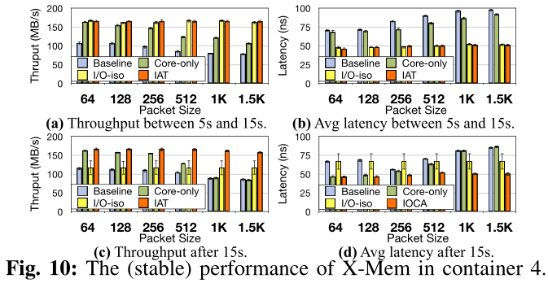

15秒后，由于DDIO再次与容器4共享(两个)LLC way，IAT通过容器4核心的LLC miss计数的增加，检测到系统的不稳定性，并重新洗排LLC way分配，以尽可能隔离LLC。Core-only，与DDIO共享所有四种LLC way，比在5s和15s期间遭受更严重的性能干扰，这在数据包大小较大时尤其显著。吞吐量(图10c)和延迟(图10d)都非常接近于基准。值得注意的是，在包大小较小的情况下，Core-only在图10d中的性能要优于图10b，这是因为图10d中DDIO的LLC way足够多，可以将入站包分配到更大的空间，从而分摊竞争。对于I/O-iso，它有更少的LLC空间(11−4 = 7 ways)用于核心。回顾脚注1,PC容器必须共用7−2 = 5 ways。根据容器4和0或1之间的相对优先级，容器4可能有1∼3 ways(即图10c和图10d中的大范围)，从而导致延迟和吞吐量下降。

为了展示IAT的动态性能，在图11中，我们用1.5K的包大小描述了使用IAT的LLC分配和容器4的LLC miss(我们有另一个独立的pqos进程每0.1s测量一次)。我们发现IAT能够对系统/应用程序的阶段变化做出及时的反应(在睡眠间隔的时间范围内)，这反映在硬件指标上。

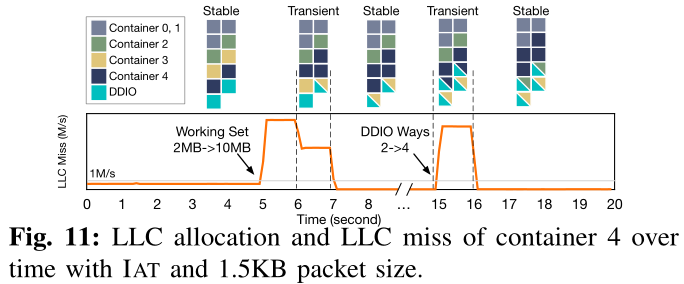

### 6.C 应用结果

我们将两组应用程序作为非网络云工作负载进行评估。(1)SPEC2006基准套件。我们运行选定的内存敏感基准测试，所有这些都使用ref输入。(2)RocksDB，一个持久的键值存储。我们使用0.99 Zipfian分布的YCSB来测试RocksDB的性能。为了避免任何存储I/O操作，我们只加载10K条记录(每条记录1KB)，这样所有记录都在RocksDB的memtable中。

我们选择内存中键值存储(KVS)和网络功能虚拟化(NFV)服务链作为两种代表性的网络工作负载，因为它们都涉及巨大的网络流量，并且对缓存敏感，这是DDIO和IAT的目标用途。

**内存KV存储**

我们使用Redis，一种流行的内存KVS来进行实验。我们运行两个Redis容器，每个容器都有两个专用内核，并将它们连接到OVS, OVS运行在另外两个专用内核上。OVS和两个Redis容器共享三个LLC way(没有DDIO重叠)。此外，我们有一个PC容器在一个专用核心和两个LLC way上运行SPEC2006基准或RocksDB。我们也有两个BE容器，每个都有两个LLC way和一个专用核心，运行X-Mem随机读取，但有不同的工作集(一个1MB，一个10MB)。总之，分配了9个核心。最初，对三个非网络容器的LLC way分配随机打乱，不考虑DDIO。这两个网卡连接到OVS，我们从流量生成器机器上运行YCSB基准测试(每个都使用8个线程)。我们预加载1KB大小的1M记录，并运行不同的测试操作。

**NFV服务链**

我们运行一个基于FastClick的有状态服务链（with and without IAT）。该服务链由三种网络功能(NFs)组成:基于分类的防火墙、基于AggregateIPFlows的流统计和网络地址/端口转换器(NAPT)。这两个网卡中的每一个都被虚拟化给两个带有不同VLAN标签的vf。我们有四个相同的容器，每个都绑定到一个VF(即，每个容器处理一个VLAN的流量)，在四个独立的专用核心上运行服务链。这四个容器共享三个LLC way(没有DDIO重叠)。非网络工作负载与KVS实验相同。我们从两个流量发生器机器产生四个VLAN的流量(所有1.5KB数据包)，带宽相等，即每个VLAN 20Gbps。

为了隔离DDIO造成的性能影响并突出这项工作致力于解决的两个问题，我们暂时禁用了IAT为租户分配更多/更少LLC way的功能(但不同租户的way仍将被打乱)。我们首先单独运行每个应用程序以获得完全隔离的性能。然后，我们在上述场景中使用或不使用IAT(即基准和IAT)共同运行应用程序。我们将每种情况运行10次，并收集每个应用程序的性能下降情况。

我们首先在图12中报告了每个非网络应用程序的执行时间。对于SPEC2006，每个基准测试的工作集大小和缓存灵敏度不同。但是一般来说，在没有DDIO感知和IAT的情况下，我们观察到与Redis一起运行时，性能下降了2.5% ~ 14.8%，与FastClick一起运行时，性能下降了3.5% ~ 24.9%。如果不支持DDIO，则非联网应用程序可能会受到似乎与之完全隔离的联网应用程序的影响。换句话说，如果其LLC部分恰好与DDIO重叠(如图12及下图中基准的最大值)，则会出现显著退化;如果没有重叠(如图12和下图中基准的最小值)，则影响较小——这会导致基准结果的范围较大(回想一下，LLC分配在开始时是随机打乱的)。然而，IAT可以有效且稳定地保持性能隔离(最多降低5.0%)。为什么它不完全匹配的单独运行的性能是因为:(1)部分LLC与DDIO重叠时可能会不可避免的IAT分配更多的DDIO LLC way(例如,High Keep状态)；(2)内存带宽消耗的网络应用也会影响非网络应用程序的性能。应用Intel内存带宽分配(MBA)可以解决这一问题，这超出了本文的范围。类似地，RocksDB的YCSB工作负载具有不同的缓存位置需求，因此在不同程度上受到网络应用程序的影响(分别为2.6% ~ 14.9%和6.5% ~ 20.6%)。同样，IAT打乱了非网络应用程序的LLC way，以便尽可能地与DDIO隔离，这分别导致吞吐量下降1.2% ~ 2.6%和2.0% ~ 4.9%。同样需要注意的是，在更密集的网络流量(即，入站和出站流量的线性速率)下，FastClick通常会比Redis对非网络应用的性能产生更大的影响。我们预计Redis在一台服务器上运行更多实例时将受到更严重的影响。

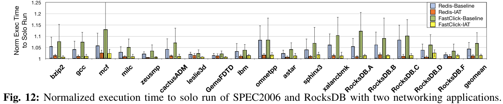

我们还在图13中报告了RocksDB的延迟结果。因为在单个YCSB基准测试中可能有多种类型的操作，所以我们对每个操作的延迟进行了标准化，并计算了加权平均值(即标准化加权延迟)。由于RocksDB的键值数据可以被入站的DDIO数据从LLC中清除到主存中，平均延迟性能可能比单独运行要差得多(即，Redis高达14.1%，FastClick高达19.7%)。IAT可以通过对非网络应用程序的LLC way进行重组来帮助减轻这种意外的逐出，最多会导致6.4%和9.9%的延迟。

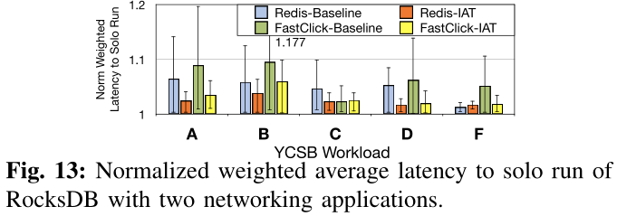

然后讨论网络应用程序的性能。图14为Redis的YCSB结果。在基准中,因为未考虑DDIO，如果一个应用程序严重消耗缓存资源(例如,X-Mem 10 mb工作集,mcf, omnetpp, xalancbmk SPEC2006,和RocksDB)恰好与DDIO共享LLC way，非网络应用程序和网络应用都会受到不利影响。具体来说，我们可以看到在不同的YCSB工作负载中，吞吐量下降了7.1% ~ 24.5%，平均延迟延长了7.9% ~ 26.5%，尾部延迟延长了10.1% ~ 20.4%，特别是在涉及密集读操作的工作负载中(例如，A、B、c、c、c)。和C). IAT通过(1)为DDIO分配更多的LLC way来将入站数据包注入LLC；(2)shuffle LLC way来减少(或消除)DDIO和cache-hungry应用程序之间的重叠。这两种方法似乎有点矛盾，因为DDIO的更多LLC way意味着更多的机会与其他应用程序重叠。但实际上，随着DDIO中LLC way的增多，入站数据包可以在LLC way之间均匀分布，从而摊销每一个LLC way的压力。即使有一些way是重叠的，总的好处仍然超过负面影响。因此，IAT将性能下降降到2.8% ~ 5.6%、2.9% ~ 8.9%和2.8% ~ 8.7%。

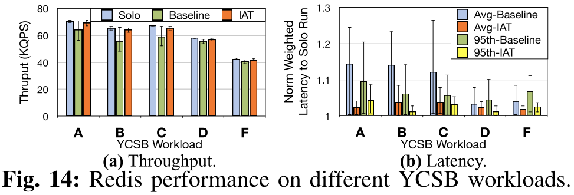

对于FastClick，由于我们使用的是大数据包，CPU核心并不是数据包处理的瓶颈，我们没有观察到服务链有意义的吞吐量下降。此外，由于我们使用的软件包生成器的限制，我们无法报告平均和尾部延迟。然而，与基准相比，我们确实看到了更低的最大往返时延和更少的时间差异(即，两个连续数据包的往返时延之间的显著差异)。这说明，IAT允许从LLC获取和处理更多的数据包，使FastClick服务链的性能更加稳定。

### 6.D IAT开销

我们设置了不同数量的租户，并测量每个间隔的IAT守护进程的执行时间(不包括初始化时间和睡眠时间)。我们测量了两种情况:(1)每个租户有一个专用核，(2)每个租户有两个专用核。我们在其专用核心上运行IAT守护进程1000秒，并报告平均值。我们将结果分为两类，即稳定的(只有Poll Prof Data时间)和不稳定的(Poll Prof Data + State Transition + LLC Re-alloc时间)，并将其描述在图15中。

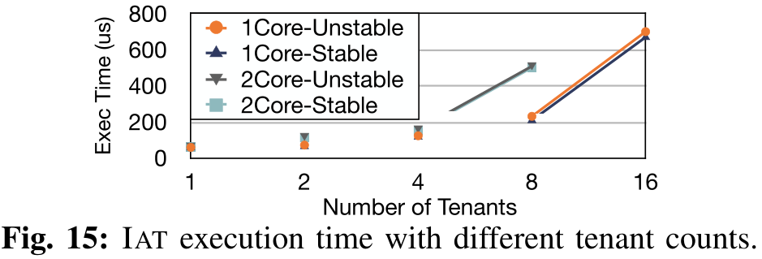

首先，IAT的大部分执行时间都花在Poll Prof Data步骤上，而执行State Transition和LLC realloc相对便宜。这是因为，在Poll Prof Data步骤中，守护进程需要读写CPU硬件性能计数器，每个计数器都需要代价高昂的上下文切换。相比之下，State Transition步骤主要是分支和数值比较，LLC Re-alloc通常只涉及几次(少于5次)CPU寄存器写操作。

其次，IAT的执行时间与它所监视的核数大致呈子线性增长。监视更多的内核意味着更多的读计数器操作，这是执行时间的主要部分。此外，由于上下文切换的开销得到了缓解，在相同的内核数量下，更少的租户对应更短的时间。即使在大量核的情况下，IAT的执行时间也不超过800us，这说明了IAT的轻便性和高效性。也就是说，在本文中给定1秒的时间间隔，如果在租户的核心上共同运行IAT，则可能只会给系统增加微不足道的开销(即，最多0.08%)。

我们还做了一个实验，将IAT与X-Mem容器放在一起，在III-B中配置了约100%的核心利用率，结果发现X-Mem吞吐量受到约0.5%的影响，而对X-Mem延迟没有实际影响。

## 7. 讨论

**IAT的局限性**

首先，像大多数基于现代Intel cpu的机制一样，IAT只能以LLC的way粒度进行分区，这是一种商用硬件限制。英特尔cpu上的低结合性(11-way)可能会导致内存不足(当分配多个租户时)和性能下降。缓解这种情况(但放松严格隔离)的一种方法是对租户进行分组，并分配LLC的way。

其次，作为大多数动态LLC分区建议的一个硬限制，IAT不能处理微秒级的流量/工作负载变化。这主要是因为(1)缓存需要一定的时间才能生效，(2)较短的间隔可能会导致采样数据的波动。换句话说，即使在一个单一的细粒度例程中，也可能存在具有不同特征的步骤，这些特征更加短暂。例如，当间隔为1ms或更短时，即使受监视的租户在没有任何干扰的情况下一直在做稳定的工作，一些工作负载的IPC值也会大幅波动。而且，在这个时间尺度上访问CPU寄存器的时间是不可忽略的。在这种情况下，IAT应该与最先进的CPU核心调度机制协同工作，以保持严格的性能隔离。

最后，IAT依赖一些用户提供的租户信息来描述工作负载。然而，我们认为这不是一个问题，因为我们的目标是需要极高性能的场景，这在私有云中比公共云更常见。在私有云中，基本的租户信息对运营商应该是透明的。

**硬件上的IAT**

IAT可以在硬件上实现。一方面，它允许我们考虑每个设备的DDIO统计数据，并基于这些统计数据以更快的速度调整细粒度的DDIO，而不必担心性能开销。另一方面，硬件实现可以使DDIO在运行时选择LLC way-它将允许DDIO对LLC中的数据目的地有更细粒度的(每个cacheline)控制，并可以更快地检测/反应争用/拥塞(微秒级)。

**DDIO用于远程套接字**

目前，DDIO只支持本地套接字。也就是说，入站数据仅被注入到对应I/O设备所连接的套接字中，即使应用程序运行在远程套接字上。克服这一限制的一个解决方案是多插槽NIC技术，其中来自同一个NIC的入站数据可以被分派到不同的插槽。我们还希望DDIO可以通过套接字互连(即Intel UPI)来支持远程套接字。

**未来DDIO的考虑**

当前在Intel cpu中的DDIO实现不区分设备和应用程序。也就是说，来自各种PCIe设备的入站流量(包括write update和write allocate)被同等对待。这反过来又可能导致同时使用DDIO的应用程序之间的性能干扰。例如，一个具有大量入站流量的BE批处理应用程序(如Hadoop)可能会从DDIO的LLC way驱逐其他PC应用程序(如Redis, NFs)的数据，从而导致这些PC应用程序的性能下降。然而，批处理应用程序的性能对内存访问延迟不敏感，从LLC而不是内存中获取数据并没有收益。我们希望未来英特尔cpu中的DDIO可以是设备感知的。也就是说，它可以将不同的LLC way分配给不同的PCIe设备，甚至在单个设备中分配不同的队列，就像CAT在CPU核心上所做的那样。此外，我们希望DDIO可以是应用程序感知的，这意味着应用程序可以选择完全或部分使用DDIO。例如，为了避免缓存污染，应用程序可能只对包头启用DDIO，而将有效负载留给内存。IAT可以进一步发展以利用这种意识。

## 8. 相关工作

### 8.A Cache分区和隔离

在前几节中，我们已经讨论了先前使用硬件/软件技术进行缓存分区的研究。他们中的大多数在分配过程中没有考虑/利用I/O相关的LLC。CacheDirector提出了一个方法，能更好地利用DDIO特性，通过将最关键的数据导向核心的本地LLC片,但它没有考虑干扰和适用性能，而且只有在每个核工作集可以放入一个LLC片时有效，这对许多应用程序是不现实的。IAT是对这些先前的建议的补充，并可以与它们共同提供一个更全面和更健壮的缓存QoS解决方案。

SLOMO观察到DDIO引起的NFV性能争用。然而，它既没有阐明根本原因，也没有提出解决方案。Farshin、Roozbeh、Maguire和Kostic对多个场景下的DDIO进行了性能分析，并提出了一些优化指南。然而，他们对DDIO的猜测并不准确。例如，他们推测来自I/O和core的数据在不同的LLC way中具有不同的驱逐优先级，这是不正确的。另一个例子是，他们描述当禁用DDIO时, LLC将被完全绕过。但实际上，数据首先仍然在LLC(控制器)中。我们澄清了第II-B节中DDIO行为的混乱，并为I/O感知LLC管理提出了一个具体和系统的解决方案。

### 8.B I/O性能分区

有很多关于不同应用程序/租户的I/O分区的文章，包括I/O排队和调度/节流、应用程序的优先级/分类和软硬件共分区。虽然这些解决方案提供了不同级别(设备、操作系统、应用程序等)的隔离，但它们都没有研究过I/O对CPU LLC的干扰，这不可避免地导致了I/O密集型场景下应用程序的性能下降。IAT提供了识别和减轻这种干扰的能力，因此可以与这些I/O分区技术一起工作。

## 9. 总结

在使用Intel®DDIO技术的现代云服务器中，I/O已经成为影响CPU LLC性能和利用率的一个重要因素。本文首先总结了DDIO带来的两个问题，然后提出了第一个用于LLC管理的I/O感知机制IAT，该机制不仅为核心分配LLC way，也为I/O分配LLC way。我们的实验表明，IAT能够有效地减少DDIO在应用程序之间造成的性能干扰。希望本文能够引起体系结构界和系统界对基于I/O感知的LLC管理的更多关注。