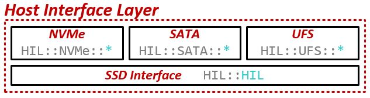

# SimpleSSD-FullSystem

---
## 1. Start

### 1.1 安装依赖

- `apt install build-essential`
- `apt install scons python-dev zlib1g-dev m4 cmake`
- `apt install libprotobuf-dev protobuf-compiler`
- `apt install libgoogle-perftools-dev`

### 1.2 下载SimpleSSD

- `git clone git@github.com:simplessd/simplessd-fullsystem`
- `cd simplessd-fullsystem`
- `git submodule update --init --recursive`

### 1.3 Build

- `scons build/ARM/gem5.opt -j 8 --ignore-style`
- `scons build/X86/gem5.opt -j 8 --ignore-style`

### 1.4 系统仿真

- 下载文件
    - https://drive.google.com/drive/folders/14b-kJmGXOhltX9Aqr8XV9i48KkZk4Lzs?usp=sharing
- `mkdir $HOME/m5`
- `export M5_PATH=$HOME/m5`

### 1.5 ARM专用依赖

- `apt install device-tree-compiler`

## 2 运行

- 一般命令格式：`./build/<arch>/gem5.<build mode> [gem5 options] <simulation script> [script options]`
- <arch\> 可以是ARM或X86， SimpleSSD只支持这两种架构。
- <build mode\> 可以是debug、opt、fast、prof和perf，更多细节可以查看[gem5 build命令](http://www.gem5.org/documentation/general_docs/building)。
- <simulation script\> 定义了仿真的硬件和软件系统。gem5在 **configs/example** 内提供了仿真脚本示例。修改了默认的全系统仿真脚本 (**configs/example/fs.py**) 来支持gem5内部使用SimpleSSD。

### 2.1 运行ARM架构

- `./build/ARM/gem5.opt --debug-flag=M5Print --debug-file=debug.txt 
    ./configs/example/fs.py --kernel=aarch64-vmlinux-4.9.92 
    --dtb-file=armv8_gem5_v1_4cpu.dtb --machine-type=VExpress_GEM5_V1 
    --num-cpu=4 --cpu-clock=2GHz --caches --l2cache --cpu-type=AtomicSimpleCPU 
    --mem-size=4GB --mem-type=DDR4_2400_8x8 
    --ssd-interface=nvme --ssd-config=./src/dev/storage/simplessd/config/sample.cfg`

### 2.2 运行选项

#### 2.2.1 gem5运行选项

|选项|描述|
|:-:|:-|
|--debug-flag|设置以逗号分隔的调试标志列表。这决定了哪些硬件模块的调试日志会被打印。|
|--debug-file|设置用来存储调试日志的文件。|
|--outdir, -d|设置用来存储所有仿真输出的目录。|
|--redirect-stdout, -r|将gem5的stdout和stderr重定向到 **simout** 文件。可以使用--stdout-file选项更改重定向的文件名。|
|--redirect-stderr, -e|将gem5的stderr重定向到 **simerr** 文件。可以使用--stderr-file选项更改重定向的文件名。|
- 要了解更多的选项，可以运行`./build/ARM/gem5.opt --help`命令，或查看[gem5帮助文档](http://old.gem5.org/Running_gem5.html)。 

#### 2.2.2 仿真脚本运行选项

|选项|描述|
|:-:|:-|
|--kernel|设置要使用的内核映像，路径相对于$M5_PATH/binaries。|
|--num-cpu|设置系统进行仿真的CPU数。如果仿真ARM，则应使用dtb文件中定义的相同值。如果仿真X86，当系统仿真两个或更多CPU时，仿真可能会不稳定。|
|--cpu-type|设置要使用的CPU型号，默认值为AtomicSimpleCPU。可以使用--list-cpu-type选项查看可能的值。SimpleSSD支持gem5提供的所有CPU模式。如果正在使用X86，则在使用其他CPU型号而不是AtomicSimpleCPU时，仿真可能会不稳定。|
|--cpu-clock|设置CPU的时钟速率 (频率) 。|
|--caches|启用私有L1I和L1D缓存。可以使用下列选项改变大小和关联性：--l1i_size，--l1d_size，--l1i_assoc和--l1d_assoc。|
|--l2cache|启用共享的二级缓存。可以使用以下选项更改大小和关联性：--l2_size和--l2_assoc。|
|--mem-size|设置系统内存 (DRAM) 的容量。|
|--mem-type|设置要使用的内存模型。可以使用--list-mem-type选项查看可能的值。|
|--script|设置仿真启动后自动执行的脚本文件。|
|--root-device|将磁盘分区设置为以root身份挂载（例如/dev/sda1）。|
|--disk-image|设置磁盘映像以用作OS镜像。仿真X86时，默认值为x86root.img；仿真ARM时，默认值为linux-aarch32-ael.img或linaro-minimal-aarch64.img。路径相对于$M5_PATH/disks。|

 下表中为ARM专用的选项：  

|选项|描述|
|:-:|:-|
|--dtb-file|设置已编译的DeviceTree（dtb）文件。|
|--machine-type|设置仿真的硬件平台。可以使用--list-machine-type来查看可能的值，但SimpleSSD仅支持VExpress_GEM5_V1。|

 下表中为SimpleSSD添加的选项：

|选项|描述|
|:-:|:-|
|--ssd-interface|设置要使用的主机接口协议/硬件。默认值为nvme。可能的值：nvme，ocssd1，ocssd2，sata和ufs。ufs仅适用于ARM架构。|
|--ssd-config|设置SimpleSSD配置文件，路径相对于当前工作目录|

#### 2.2.3 配置文件

- 样本配置文件可查看 **src/dev/storage/simplessd/config/sample.cfg** 。
- 可以从[此处](https://docs.simplessd.org/en/v2.0.12/download.html#download-config-file)下载在验证过程中使用的配置文件。

## 3 运行结果

本节介绍如何分析仿真的结果。

### 3.1 分析SimpleSSD日志和统计信息

&nbsp;&nbsp;SimpleSSD打印调试日志，其中包含有关I / O请求的所有信息以及所有组件的统计信息。

#### 3.1.1 SimpleSSD调试日志

对于SimpleSSD-FullSystem，可以在gem5的stdout上找到调试日志。对于SimpleSSD-Standalone，可以通过定义[global] DebugLogFile仿真选项决定将调试日志保存在何处。

#### 3.1.2 SimpleSSD统计信息

调试信息

### 3.2 分析Linux内核日志

#### 3.2.1 准备Linux内核

#### 3.2.2 修改内核

### 3.2.3 分析结果

### 3.3 分析仿真器的调试日志和统计信息

#### 3.3.1 SimpleSSD-FullSystem

#### 3.3.2 SimpleSSD-Standalone

### 3.4 在用户级分析

## 4 固件模型

### 4.1 主机接口层

本节介绍如何设计和实现主机控制器模型（Host Interface Layer，HIL）。  
HIL由两个部分组成。首先是主机控制器，它与主机端接口。第二个是SSD接口，它为主机控制器提供抽象的API。  

#### 4.1.1 主机控制器

在HIL中实现了三种主机控制器模型NVMe，SATA和UFS。

（1）Non-Volatile Memory Express

- 非易失性存储器Express-NVMe-是现代SSD的新兴标准。它的第一个标准-NVMHCI-于2011年发布。
- SimpleSSD基于[NVMe基本规范修订版1.2.1](https://nvmexpress.org/wp-content/uploads/NVM_Express_1_2_1_Gold_20160603.pdf)实现了NVMe接口，并且正在进行对[NVMe基本规范修订版1.3c](https://nvmexpress.org/wp-content/uploads/NVM-Express-1_3c-2018.05.24-Ratified.pdf)的更新。

#### 4.1.2 SSD接口

### 4.2 内部缓存层

### 4.3 闪存转换层

## 5 硬件模型

## 常见问题

### gem5.opt运行出错①

- 执行命令：见[2.1](#21-运行ARM架构)。
- 错误信息：IOError: Can't find file 'linux-aarch32-ael.img' on M5_PATH.  
- 解决方法：**configs/common/Benchmarks.py** 第65行的disk名修改为M5_PATH/disks内的arm镜像名。

### gem5.opt运行出错②

- 执行命令：见[2.1](#21-运行ARM架构)。
- 错误信息：IOError: Can't find file 'armv8_gem5_v1_4cpu.dtb' on M5_PATH.
- 解决方法：去掉执行命令中的 --dtb-file=armv8_gem5_v1_4cpu.dtb。

[返回主页](./index.md)