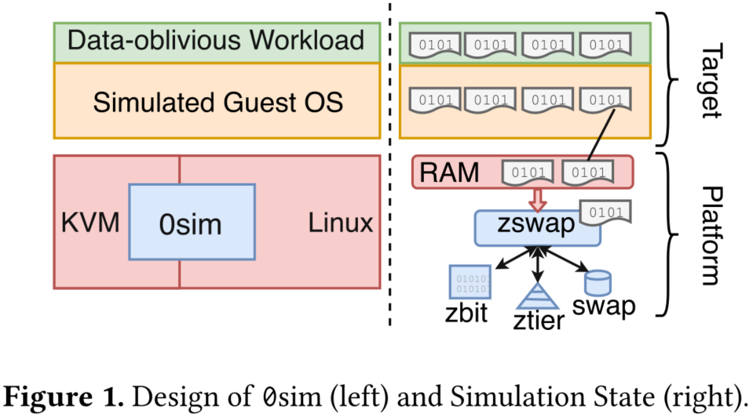

# 0sim: Preparing System Software for a World with Terabyte-scale Memories

## 摘要

最近内存技术的进步意味着商品机器可能很快就会有tb的内存;然而，这种机器在今天仍然很昂贵，也很少见。因此，很少有程序员和研究人员能够针对可伸缩性问题进行调试和原型修复，或者探索由tb级内存引起的新系统行为。

为了使这种机器能够快速、早期的原型化和系统软件的探索，我们建立了0sim模拟器，并将其开源。0sim使用虚拟化来模拟在普通机器上执行大量工作负载。我们的关键观察是，无论输入是什么，许多工作负载都遵循相同的控制流。我们称这种工作负载为数据无关的。0sim利用数据无关性，通过内存压缩使大型模拟变得可行和快速。

0sim对于许多任务来说足够精确，并且可以模拟一个比主机大20-30倍的客户系统，对于我们观察到的工作负载，它的速度是8 -100倍，更可压缩的工作负载运行得更快。例如，我们在31GB机器上模拟1TB机器，在160GB机器上模拟4TB机器。我们通过实例来说明0sim的实用性。例如，我们发现对于混合工作负载，尽管有几十gb的空闲内存，Linux内核仍然可以创建不可修复的碎片，并且我们使用0sim来调试带有大量内存的memcached的意外失败。

## 1. 引言

自从计算机出现以来，计算机内存的大小一直在增长。随着内存容量呈指数级增长(例如，IBM的System/360的架构限制为28MB[11])，过去严格限制最大内存量的设计面临着巨大的困难。随着技术的进步，存储器的密度大大增加，成本大大降低，这种增长趋势将继续下去。最近，英特尔的3D Xpoint内存支持高达6TB的双插槽机器。因此，多tb的系统可能会变得普遍，为未来拥有几十到几百tb内存的系统铺平道路。

迫切需要研究大内存系统(多个tb或更多)上的系统软件和应用程序的可伸缩性，为增加内存容量做准备。虽然在今天可以容忍，但是当内存增加10-100倍时，许多常见操作系统算法的线性计算和空间开销可能是不可接受的。其他系统软件，如语言运行时和垃圾收集器也需要重新设计，以便在多tb内存系统上有效运行[64]。在Linux中，许多可伸缩性问题对于小内存是可以容忍的，但在更大的规模下则是痛苦的。例如:

- 对于4TB的内存，Linux在启动时需要超过30秒来初始化页面元数据，这降低了需要重新启动时的可用性。
- 在大型系统上，内核元数据增长到多个gb。在异构系统上，元数据可能会压倒较小的快速内存[26]。
- 线性复杂度的内存管理算法(如内存回收和碎片整理)在内存扩展10倍时可能会导致显著的性能开销，我们稍后将说明这一点。
- 大页面对于大型系统上的TLB性能至关重要，但是以前发现形成大页面的内存碎片整理会导致某些应用程序出现较大的延迟峰值[4,32,58,63]。
- 为小内存构建的内存管理策略(例如允许固定百分比的缓存文件内容是脏的)在大内存中表现很差，当这个小百分比由几百gb的[59]组成时。

我们预计，当内存规模增长到tb级甚至更高时，系统设计师将遇到新的可伸缩性问题。但是，探索具有巨大内存的系统行为、再现可伸缩性问题和原型解决方案需要开发人员以巨大的成本或不便拥有或租用一个系统。4TB实例的云服务每小时成本超过25美元[9,41,57]。较大的实例需要三年的合同，费用超过$780,000[10,57]。

为此，我们构建并开源了0sim(“zero·sim”)，这是一个基于虚拟化的平台，用于在多tb的机器上模拟系统软件行为。0sim运行在一个商用主机(平台)上，并为用户提供一个虚拟机(模拟目标)，该虚拟机具有巨大的物理内存。0sim足够快，可以进行大规模的、长时间运行的模拟，甚至可以进行直接的交互，既可以进行性能测量，也可以进行可伸缩性问题的交互调试。

我们采用了几种新技术将tb级的目标内存内容放入gb级的平台内存中。首先，我们注意到许多程序是数据无关的:它们执行相同的计算而不依赖于输入值。因此，我们可以使用预先确定的输入来执行目标;那么，0sim就可以将预先确定内容的4KB页面压缩为1位。其次，当前的处理器可能有较小的物理地址空间来简化CPU设计。我们使用软件虚拟化技术来确保模拟的物理地址不会被平台CPU看到，而是由0sim进行转换。因此，我们的系统可以模拟给定目标体系结构的最大允许地址空间。最后，通过公开报告目标时间流逝的硬件时间戳计数器，我们可以在模拟中实现高效的性能度量。

0sim模拟了目标的功能和性能方面，就像在一个真正的多tb机器上测量一样。0sim的目标不是成为一个体系结构模拟器或完全准确，因为目标可能在许多方面不同于平台，包括处理器微体系结构。相反，0sim能够很好地模拟系统软件，以满足再现可伸缩性问题、原型化解决方案和探索系统行为等重要用例的需要。0sim为了提高仿真速度而牺牲了一些精度，从而实现了大型、长时间运行的仿真和交互式调试。

本文介绍了0sim的体系结构和实现。我们根据这些目标验证了0sim的准确性和模拟速度。0sim可以模拟比平台大20-30倍的目标系统，与我们测试的工作负载的本地执行相比，只有8 -100倍的速度放缓，更可压缩的工作负载运行得更快。例如，我们在160GB平台上模拟4TB的memcached目标，在30GB平台上模拟1TB的memcached目标，只有8倍的速度。相比之下，体系结构模拟器会导致10,000倍甚至更糟的减速[21]。

我们执行了几个案例研究来证明0sim的有效性:我们重现并扩展了一个建议的内核补丁的开发人员性能结果;我们将内存压缩对memcached尾部延迟的最坏影响衡量为22倍的减速;我们表明，对于混合的工作负载，Linux可能导致不可修复的内存碎片，即使有几十gb的空闲内存;同步页面回收可以以非常小的额外延迟为代价提高效率。此外，我们使用0sim交互式地调试memcached中的可伸缩性bug，该bug只在内存超过2TB时发生。0sim可以在https://github.com/multifacet/0sim-workspace上找到。

## 2. 问题:根据内存容量进行缩放

0sim解决了研究软件如何利用内存容量进行扩展的关键需求，包括有效利用内存、解决算法瓶颈以及设计具有巨大内存容量的策略。此外，它为开发人员消除了限制软件在大内存系统中进行有效测试和部署的障碍。

**计算效率低下**：任何执行时间随内存量线性增加的操作都可能成为瓶颈。例如，页帧回收算法、大页压缩、页重复数据删除、内存分配和脏/引用位抽样都是对每页元数据进行操作的。如果内核试图透明地将一系列页面升级为一个巨大的页面，那么运行巨大的页面压缩可能会导致应用程序中出现不可预知的延迟峰值和长尾延迟。这导致许多数据库和存储系统建议关闭这些内核特性，尽管这些特性可能带来性能提高[4,32,58,63]。

同样，分配、初始化和销毁页表的代价可能非常昂贵。这会影响创建和销毁进程或服务页面错误的时间。Linus Torvalds认为，为预填充页表分配页的开销使得mmap的MAP_POPULATE标志用处更小，因为它的延迟高得不可接受[75]。

另一个例子是Linux内核的结构页[27]。大内存系统可能有数十亿个这样的结构，为每个4KB的物理内存页存储元数据。在一个4TB的系统中，在我们的测试机器上，初始化它们并在启动时将它们释放到内核的内存分配器分别需要18秒和15秒。这对服务可用性有影响，其中内核的引导时间可能位于服务重新启动的关键路径上。

**内存使用情况**：在某些情况下，任何与主存大小成比例的内存使用都可能占用太多空间。例如，一台具有少量DRAM和tb级非易失性内存的机器可能会发现它的所有DRAM都被页表和非易失性内存[26]的内存管理元数据所消耗。

如前所述，对于每个4KB的页面，Linux内核都保留一个200字节的带有元数据的结构页。类似地，在巨大的系统[37]上，用于地址转换的页表可能会消耗几十gb的内存。虽然这个空间可能只占总内存的一小部分，但它会消耗宝贵的系统资源，并且如上所述，会增加管理的时间成本。

**Huge-Memory-Aware政策**：针对小内存的有效内存管理策略在大规模时可能表现不佳。例如，在Linux内核中，一旦脏页超过了一定的内存百分比，就会将它们刷新到存储中，但是在巨大的机器上，这会导致长时间的暂停，因为gb的数据被从[59]中刷新出来。另外，一些使用巨大内存来缓冲流数据的应用程序发现内核页面缓存是一个瓶颈[30]。在一个巨大和/或非易失性内存的时代，页面缓存应该扮演什么角色并不清楚。随着高吞吐量、低延迟的网络、存储和大内存变得越来越普遍，重新评估缓冲和刷新脏数据的内核策略非常重要。

同样，需要检查用于大型连续分配和碎片控制的策略。许多现代高性能I/O设备，如网卡和固态驱动器，使用大型物理连续固定内存缓冲区[33]。研究人员提出了大型连续分配以减少TLB miss的开销[14,39]。为了满足这样的内存分配，内核必须控制物理内存碎片，这在Linux中一直是一个问题[28,30]。另一个补充问题是，在多tb的系统上，急切分页[39]和透明的大页面所引起的内部碎片的影响。对于较小的系统，这些问题已经得到了很好的研究，但是据我们所知，在大内存系统和工作负载上还没有重新讨论过这些问题。

容量可伸缩性问题并非操作系统所独有。其他系统软件，如语言运行时，也需要适应巨大的内存系统。例如，Oracle的Java虚拟机采用了针对大内存系统优化的新的垃圾收集器[64]。

**发展的障碍**：由于费用问题，大内存系统并不常见。因此，系统软件不能很好地测试将很快普及的大内存系统。在我们的工作中，我们经常发现软件有bug和任意的硬编码限制，导致它在大内存系统上失败。通常，由于不相关的内核恐慌或无限期挂起等用户不友好的故障模式，这些限制并没有很好地记录下来，而且故障很难调试。0sim让开发人员更容易大规模测试软件。

## 3. 相关工作

**仿真**通常用于硬件不可用的情况(例如，处理器模拟器[21])。与其他硬件进步(如提高处理器核心或设备速度)不同，在现有硬件上模拟内存容量具有挑战性，因为必须维护大量的状态。Alameldeen等人通过费力地缩减和调整他们测试[8]的基准和系统来解决这个问题。虽然准确，但这种方法容易出错、繁琐且难以验证。在Quartz和Simics中，模拟尺寸受主机尺寸的限制[37,76]。0sim通过利用数据无关性来存储比主机的内存或存储容量更多的内存状态，能够在一个适中的主机上运行大型模拟。研究人员通过减慢模拟机器的时钟[44]来模拟快速网络。0sim同样会调整目标对时间推移的看法。David[6]和Exalt[78]通过只存储元数据和在读取时生成内容来模拟大型存储系统。这种技术对于内存来说很困难，因为在大多数程序中，重要的元数据并没有与可丢弃的数据分开。0sim通过预先确定的输入来实现类似的结果。多个系统将一个机器集群虚拟化，从而产生一个单独的大型虚拟机[16,23,72,74];Firesim使用基于云的加速器来缩放模拟[52]。相比之下，0sim使用虚拟化，但在单一的商品主机上，这对研究人员和开发人员更容易访问。

**可伸缩性**：之前的大量工作已经研究了系统软件中不同类型的可伸缩性问题。例如，RadixVM试图克服由于内核数据结构[24]上的内存管理操作的序列化而导致的高并发工作负载中的性能问题。其他研究表明，struct page、struct vm_area_struct和页表倾向于构成内存管理开销[37]的很大一部分。Java 11提供了一个新的垃圾收集器，它允许扩展到tb级的堆，同时保持低延迟[64]。然而，针对提高系统在内存容量方面的可伸缩性的工作很少。0sim使解决这个问题的原型和测试软件变得很容易。

**技术**：0sim的设计和实现利用了许多已知的软件技术来有效地过度使用内存。我们的贡献之一是展示0sim如何使用这些技术来构建一种新的模拟方法。页面压缩和重复数据删除可以在使用过量的情况下增加内存利用率;它们在广泛使用的软件中实现，如Linux、MacOS和VMware ESX Server[2,3,12,77]。在Linux中，通过使用更有效的分配器[60]和优化相同填充的页面[35]，已经完成了提高可实现的内存压缩比的工作。远程内存建议通过网络将页面交换到远程机器，允许更大的工作负载在本地运行[38,43]。基于硬件的内存压缩[5]和零感知优化[36]的工作也已经完成，但这些建议需要专门的硬件，不像0sim。

## 4. 0sim设计

0sim允许在具有巨大物理内存的机器上评估系统软件。我们强调0sim不是一个架构模拟器;相反，它有以下目标:

- 运行在廉价的硬件上。
- 对模拟软件要求最小的更改。
- 保持性能趋势，而不是精确的性能。
- 运行足够快以模拟长时间运行的工作负载。

图1(左)显示了0sim架构的概述。0sim引导一个目标虚拟机(VM)，使用的物理内存比主机或平台上可用的物理内存大数量级，同时保持合理的模拟速度。0sim是作为在平台上运行的经过修改的内核和管理程序实现的，但不需要进行任何目标更改。任何未修改的目标操作系统和各种各样的工作负载都可以通过在目标中执行它们来模拟(例如，通过SSH)。x86 rdtsc指令可以在目标中用来读取硬件时间戳计数器(TSC)，以进行模拟时间测量。

0sim力求保持趋势，而不是精确预测性能，从而在模拟速度和系统的易用性与准确性之间进行权衡。0sim在模拟环境中保留了时间指标(例如，延迟)和非时间指标(例如，内存使用)的趋势。例如，0sim可用于比较两个目标的性能，以衡量优化的影响。

0sim面临的主要挑战是(1)模拟巨大的内存(2)保存时间度量。我们使用数据无关的工作负载和内存压缩来解决(1)。我们通过虚拟化TSC来解决(2)。

### 4.1 Data-Obliviousness

模拟大内存系统与模拟cpu或网络设备等更快的硬件有本质的不同。如前所述，模拟巨大的内存需要维护比平台能够容纳的更多的状态。0sim依赖于平台内核的交换子系统，以透明地将目标状态溢出到交换设备。然而，平台可能没有足够的交换空间用于我们希望模拟的状态;即便如此，从存储中写入和读取所有状态也会非常缓慢，而且会使大型的、长时间运行的模拟变得不切实际。

我们的关键观察是，无论输入是什么，许多工作负载都遵循相同的控制流。我们称这种工作负载为数据无关的。例如，内存中的memcached键值存储并没有根据键值对中的值而表现出不同的行为——只有键。另一个例子是固定计算，如矩阵乘法;我们可以用稀疏或已知的矩阵提供矩阵工作负载。一个工作负载，NAS共轭梯度基准[13]，自然使用稀疏矩阵。

图1(右)描述了0sim中目标状态的管理。为数据无关的工作负载提供预先确定的数据集，使其能够在不改变其行为的情况下进行内存压缩。0sim能够识别带有预先确定内容的页面(例如，一个零页面)，并将它们压缩到1位，存储在一个名为zbit的位图中。与预先确定的内容不匹配的页面可以被压缩并存储在名为ztier的高效内存池中。这允许0sim运行大量工作负载，同时在一个更普通的平台机器上保持模拟状态。此外，由于大部分模拟状态都保存在内存中，所以与必须将所有状态写入交换设备相比，zbit能够更快地模拟。例如，在我们的工作站上，将4KB写入SSD大约需要24个µs，而LZO压缩[62]只需要4个µs。

0sim的模拟性能依赖于数据无关性。有些有趣的工作负载很难做到与数据无关，比如图表和带有反馈循环的工作负载。尽管如此，要学习系统软件(如内核)，数据无关的工作负载可以以不同的方式(包括不同的内存分配和访问模式)有效地运行系统。因此，我们认为数据无关的工作负载足以暴露许多问题，我们的许多发现也适用于其他工作负载。例如，可以执行大部分内核内存管理子系统，因为它与页面内容无关。我们将在第8节中使用几个案例研究来演示这一点。此外，为数据无关的工作负载准备系统也有利于非数据无关的工作负载。

### 4.2 硬件限制

现有的商品系统可能不支持我们希望研究的内存数量。例如，我们的一个实验平台有39个物理地址位，只能处理512GB的内存，而我们想模拟多tb的系统。这种硬件限制防止运行大内存工作负载。0sim使用阴影页表[22]克服了地址大小的限制:是管理程序(而不是硬件)将目标物理地址转换为适当宽度的平台物理地址。虽然还没有实现，但也可以用这种技术模拟运行虚拟机[17]或5级分页的目标，这是Intel宣布的，但尚未得到广泛支持的[46]。类似地，0sim通过在管理程序中透明地使用内存压缩来利用工作负载数据无关性，从而支持大于可用交换空间的内存大小。

### 4.3 时间虚拟化

硬件模拟器，如gem5[21]，经常使用模拟器生成的离散事件来模拟时间的流逝。然而，这是非常缓慢的，与本机执行相比，会导致许多数量级的放缓。这样的慢速度使得在中或长时间尺度上研究大内存系统的行为变得不切实际。相反，0sim在平台上使用硬件时间戳计数器(TSCs)来测量时间的流逝。

每个物理核心都有一个独立的硬件TSC，可以连续运行。但是，系统管理程序中有许多开销来源，例如页面错误，这些不应该反映在目标性能度量中。我们为目标创建一个虚拟硬件TSC，只有当目标在运行时，系统管理程序才能升级这个TSC。我们通过现有的硬件虚拟化支持来实现这一点，以调整目标的虚拟化TSC。因此，在仿真中，硬件报告目标时间。

## 5. 实现

本节描述了0sim实现中具有挑战性和创新性的部分。注意0sim只在平台内核中运行;0sim可以运行任何未修改的目标内核。我们将0sim实现为对Linux内核4.4和KVM管理程序的修改。内核更改包括大约4100行新代码和770行更改，对于KVM则是400行新代码和12行更改。相比之下，gem5模拟器的[21]代码几乎有50万行。

### 5.1 内存压缩

